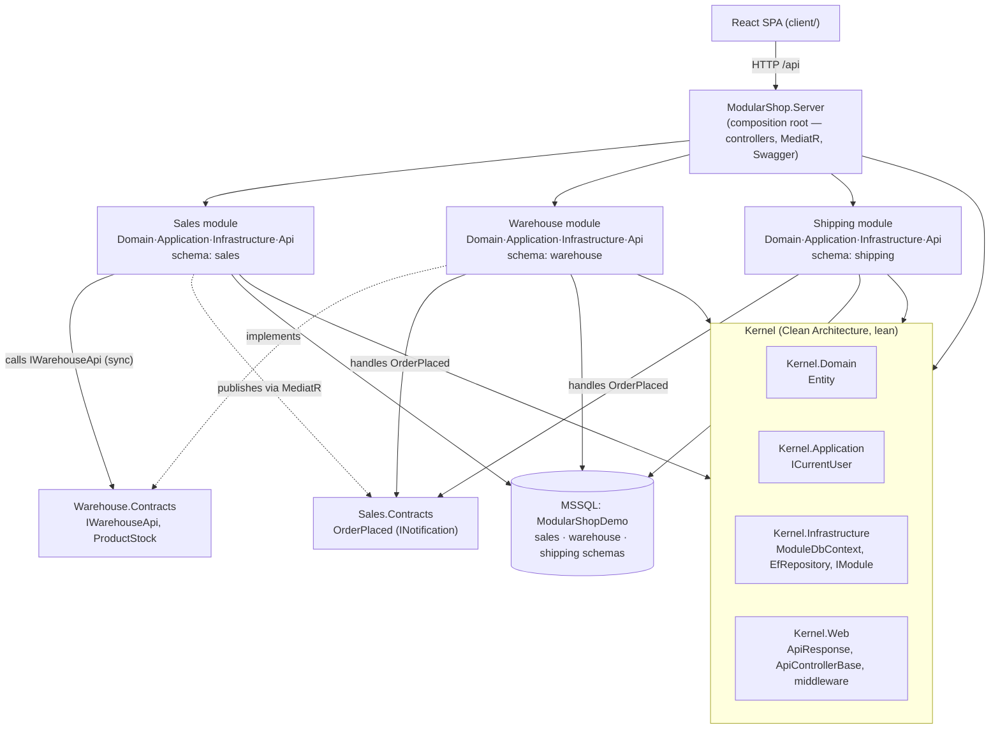
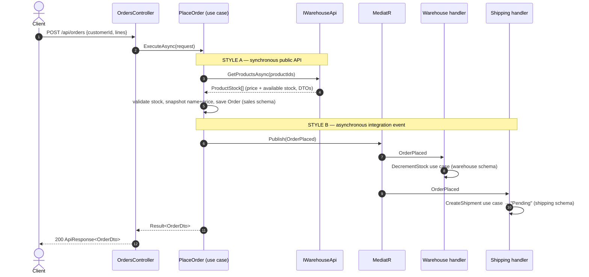

# Architecture — the Modular Monolith concepts this example teaches

ModularShop is deliberately small, but every part exists to demonstrate one Modular Monolith (MM)
concept **correctly**. This document explains each concept, points at the exact code, and shows the
module map and the order→shipment flow as diagrams.

> A **Modular Monolith** is a *single deployable unit* whose internals are split into loosely‑coupled,
> highly‑cohesive **modules organised by business capability**. Each module owns its data and exposes
> a small public contract; everything else is hidden. You get microservice‑style boundaries (high
> cohesion, low coupling, data ownership) with monolith simplicity (in‑process calls, one database,
> simple deployment).

The concepts, and where each lives:

| Concept | Where to look |
|---|---|
| 1. Encapsulation & enforced boundaries | module projects + `*.Contracts` + the project‑reference graph |
| 2. Clean Architecture **inside** each module | `*.Domain / *.Application / *.Infrastructure / *.Api` |
| 3. Schema‑per‑module | `ModuleDbContext`, `UseModuleSqlServer`, `Infrastructure/Persistence/Migrations` |
| 4. Composition root / bootstrapper | `ModularShop.Server/Program.cs`, `IModule`, ApplicationParts |
| 5. The shared **Kernel** (also Clean Architecture) | `Kernel.Domain / .Application / .Infrastructure / .Web` |
| 6. Two inter‑module communication styles | `IWarehouseApi` (sync) and `OrderPlaced` + MediatR (async) |

---

## 1. Encapsulation & enforced boundaries

A module’s domain is **hidden**. The only thing a module exposes to the outside is the public surface
in its `*.Contracts` project. The boundary is enforced by the **project‑reference graph**: no module
references another module’s `Domain / Application / Infrastructure / Api` — it may reference only the
Kernel and other modules’ `*.Contracts`.

- The public surface is a separate, tiny assembly. `Warehouse.Contracts` contains only `IWarehouseApi`
  + the `ProductStock` DTO — that is *all* the rest of the system can see of Warehouse. `Sales.Contracts`
  contains only the `OrderPlaced` event. **Shipping has no `.Contracts` project** — nothing calls into
  Shipping, so it exposes no public API. (Not every module needs one — a useful thing to see.)
- Because each layer is now its own assembly, `internal` no longer equals "module‑private". Encapsulation
  across modules is instead a **reference‑graph fact**: if Sales does not reference `Warehouse.Domain`,
  it *cannot name* `Product` — the same compile‑time guarantee, just enforced by references rather than a
  single assembly. Within a module, `internal` still hides genuinely private types (the DbContext, EF
  configurations, seeds, event handlers).

| Project | May reference |
|---|---|
| `Modules.Sales.*` | Kernel.*, `Sales.Contracts`, `Warehouse.Contracts` |
| `Modules.Warehouse.*` | Kernel.*, `Warehouse.Contracts`, `Sales.Contracts` |
| `Modules.Shipping.*` | Kernel.*, `Sales.Contracts` |
| `*.Contracts` | nothing (Sales.Contracts uses only `MediatR.Contracts` for the event marker) |
| `ModularShop.Server` (host) | everything |

Because the `*.Contracts` projects depend on (almost) nothing, the reference graph is **acyclic** even
though Sales↔Warehouse and Sales↔Shipping "talk" to each other.

> **Next step in a real system:** add an architecture test (NetArchTest) that fails the build if a
> module references another module’s implementation assembly. We omit test projects here per the brief,
> but the reference rules above already make the boundary a compile‑time fact.

---

## 2. Clean Architecture inside each module

Each module is a small Clean‑Architecture stack of **four projects**, with dependencies pointing inward:

```
  Api  ───►  Application  ───►  Domain
   │              │
   └────►  Infrastructure  ───► Application, Domain
   (host wires Infrastructure + Api together)
```

- **Domain** (`Product`, `Order`, `Shipment`, …) — entities and rules. No framework dependencies.
- **Application** — **use cases** (one class per operation, e.g. `PlaceOrder`, `ListProducts`,
  `ShipShipment`), DTOs, and **Ardalis Specifications** describing queries. Depends only on Domain and
  abstractions; it never references EF or a DbContext. Every use case returns an `Ardalis.Result<T>`.
- **Infrastructure** — the DbContext + `Persistence/` (EF configs, migrations), the generic repository
  binding, the `IModule` registration, seeding, and the **integration‑event handlers**.
- **Api** — **controllers only**. A controller injects one or more use cases, calls them, and maps the
  `Result` to an `ApiResponse<T>` via the kernel base controller. No business logic lives here.

The request path is uniform: **Controller → Use case → (repository via a Specification | `IWarehouseApi`
| MediatR publish)**. The Application layer reads/writes only through `IReadRepositoryBase<T>` /
`IRepositoryBase<T>` (Ardalis.Specification); the concrete `EfRepository<T, TContext>` lives in the
Kernel and is bound to each module’s DbContext in that module’s `Register`.

> Why specifications? Splitting a module into layers means the Application layer must not see the
> DbContext. A `Specification<T>` (e.g. `OrdersWithLinesSpec`) expresses the query in Application; the
> repository executes it in Infrastructure. That keeps the dependency rule intact without a bespoke
> query method per screen.

---

## 3. Schema‑per‑module (one database, one schema each)

All modules share **one MSSQL database** (`ModularShopDemo`), but each module owns its **own schema**
and its **own `DbContext`**. No module can see another module’s tables.

- Each context derives from `Kernel.Infrastructure/Persistence/ModuleDbContext.cs`, which calls
  `modelBuilder.HasDefaultSchema(Schema)` — so `SalesDbContext` → `sales`, `WarehouseDbContext` →
  `warehouse`, `ShippingDbContext` → `shipping`.
- Each module owns its **own EF migrations** under `Infrastructure/Persistence/Migrations/`, generated
  with the official `dotnet ef` tool.
- Even the migrations‑history bookkeeping is per‑module: `UseModuleSqlServer(cs, "sales")` puts each
  context’s `__EFMigrationsHistory` **in its own schema**, so nothing lands in the shared `dbo`.

Verified layout in the running database:

```
sales.__EFMigrationsHistory       sales.Customers   sales.Orders   sales.OrderLines
warehouse.__EFMigrationsHistory   warehouse.Products
shipping.__EFMigrationsHistory    shipping.Shipments   shipping.ShipmentItems
```

The single most important rule this enforces: **a module never shares a `DbContext` and never reaches
into another module’s tables.** When Sales needs data Warehouse owns, it asks through Warehouse’s API
(§6) and **snapshots** what it needs into its own schema — see `OrderLine` storing `ProductName` and
`UnitPrice` copies, with *no* foreign key to `warehouse.Products`.

> **Next step:** if a module ever needs independent scaling or extraction into a microservice, promote
> its schema to its own database — the code barely changes because it already has its own context.

---

## 4. Composition root / module bootstrapper

The host project `ModularShop.Server` is the **composition root**. It contains **no business logic** —
it just wires modules together through the `IModule` contract (`Kernel.Infrastructure/IModule.cs`):

```csharp
public interface IModule
{
    string Name { get; }
    void Register(IServiceCollection services, IConfiguration configuration); // its own services + DbContext
}
```

`Program.cs` holds the entire module list in one readable place and drives the lifecycle:

```csharp
IReadOnlyList<IModule> modules = [ new SalesModule(), new WarehouseModule(), new ShippingModule() ];

// MediatR scans each module's Infrastructure assembly for INotificationHandler<> (the event handlers).
builder.Services.AddMediatR(cfg => cfg.RegisterServicesFromAssemblies(
    modules.Select(m => m.GetType().Assembly).ToArray()));

// Controllers live in each module's Api project — register those assemblies as MVC ApplicationParts.
builder.Services.AddControllers()
    .AddApplicationPart(typeof(SalesApiAssembly).Assembly)
    .AddApplicationPart(typeof(WarehouseApiAssembly).Assembly)
    .AddApplicationPart(typeof(ShippingApiAssembly).Assembly);

foreach (var module in modules) module.Register(builder.Services, builder.Configuration);
// ...build app...
foreach (var initializer in scope.ServiceProvider.GetServices<IModuleInitializer>())
    await initializer.InitializeAsync();   // each module migrates + seeds ITS OWN schema
app.MapControllers();
```

Each module’s `Register` (in its Infrastructure project) wires its DbContext, repositories, use cases,
public API and initializer. Its **controllers** live in the Api project and are discovered because the
host adds each Api assembly as an **ApplicationPart** (located via a tiny marker type, e.g.
`SalesApiAssembly`). **Adding a feature = create the module’s projects and add one line to the list.**
(Some MM samples auto‑discover modules by reflection; we keep an explicit list so the wiring is obvious.)

---

## 5. The shared Kernel (itself Clean Architecture)

The kernel holds only **cross‑cutting primitives and infrastructure** — never business logic — and is
split into four Clean‑Architecture layers so its own dependencies point inward. The word "Shared" is
dropped; it is simply the **Kernel**.

| Project | Layer | Contents | Dependencies |
|---|---|---|---|
| `Kernel.Domain` | Domain | `Entity` | none (pure) |
| `Kernel.Application` | Application | `ICurrentUser` | Kernel.Domain |
| `Kernel.Infrastructure` | Infrastructure | `ModuleDbContext`, `EfRepository<T,TContext>` (on Ardalis.Specification), `UseModuleSqlServer`, `IModule`, `IModuleInitializer` | EF Core, Ardalis.Specification.EFCore, Kernel.Application |
| `Kernel.Web` | Web | `ApiResponse`, `ApiControllerBase` (maps `Result` → `ApiResponse`), `ExceptionHandlingMiddleware`, `CurrentUser` | ASP.NET Core, Ardalis.Result, Kernel.Application |

Cross‑cutting concerns like **logging** (`ExceptionHandlingMiddleware`, `ILogger`) and **identity**
(`ICurrentUser`, read from a request header for the demo) live here — the correct home for them in an
MM. Keep the kernel **lean**: an over‑fat kernel re‑couples the modules through the back door.

---

## 6. The two inter‑module communication styles

This is the heart of the example. One realistic flow uses **both** styles.

**Style A — Synchronous, through a module’s public interface.** Used when the caller needs an answer
*now*. When placing an order, Sales must know the current price and stock, so it calls Warehouse’s
public API:

```csharp
// Warehouse.Contracts (public):   interface IWarehouseApi { Task<IReadOnlyList<ProductStock>> GetProductsAsync(...); }
// Warehouse.Application (impl):    sealed class WarehouseApi : IWarehouseApi { /* queries via a Specification */ }
// Sales.Application (consumer):    injected IWarehouseApi — never sees WarehouseApi, Product, or WarehouseDbContext.
```

Return **DTOs, not entities**, and shape the API around use cases. This is real, explicit coupling
(both modules must be present), which is exactly right for "give me data now".

**Style B — Asynchronous, through an integration event.** Used for "this happened; whoever cares can
react". After the order commits, the `PlaceOrder` use case publishes `OrderPlaced` (a MediatR
`INotification`, defined in `Sales.Contracts`). Sales does **not** know who handles it. Two modules
independently do, each with an `INotificationHandler<OrderPlaced>` in its Infrastructure layer:

- `Warehouse/…/DecrementStockOnOrderPlaced` → invokes the `DecrementStock` use case (warehouse schema).
- `Shipping/…/CreateShipmentOnOrderPlaced` → invokes the `CreateShipment` use case (shipping schema).

MediatR is the in‑process bus. The host registers it once, scanning each module’s Infrastructure
assembly, so the handlers are discovered automatically. Handlers are thin adapters (event → use case),
keeping the business logic in the Application layer.

**Rule of thumb:** need a value back now → Style A (interface). Fire‑and‑forget "it happened" → Style B
(event). Integration events are part of a module’s public contract, so keep them small and stable.

> **Next step:** the in‑memory bus loses events if the process crashes mid‑handling. The production
> upgrade is a transactional **outbox** (persist the event in the same transaction as the order, then a
> background worker publishes it). The publish call would not change — that is the payoff of
> programming to the interface.

---

## Module & dependency map



## The order → shipment flow



A later `POST /api/shipments/{id}/ship` advances a shipment `Pending → Shipped` (and `…/deliver` →
`Delivered`), showing a module owning and driving its own state.

---

## What we deliberately deferred (and where it would go)

These are real production concerns, intentionally left out to keep the fundamentals visible. Each has a
natural home in this structure:

- **Transactional outbox/inbox** for reliable events → behind the MediatR publish in `PlaceOrder`.
- **Architecture tests** enforcing boundaries → a NetArchTest project asserting the reference rules.
- **Real authentication** (JWT/OIDC) → behind `ICurrentUser` in `Kernel.Web`.
- **Database‑per‑module** → change one module’s connection string; its context already isolates it.
- **CQRS command/query bus** → out of scope by the brief. MediatR is used here **only** for integration
  events (`INotification`), never for command/query dispatch.

See [`decision-log.md`](./decision-log.md) for *why* each choice was made and what alternatives were
weighed, and [`platform-mapping.md`](./platform-mapping.md) for how this maps back to the Platform
solution.
