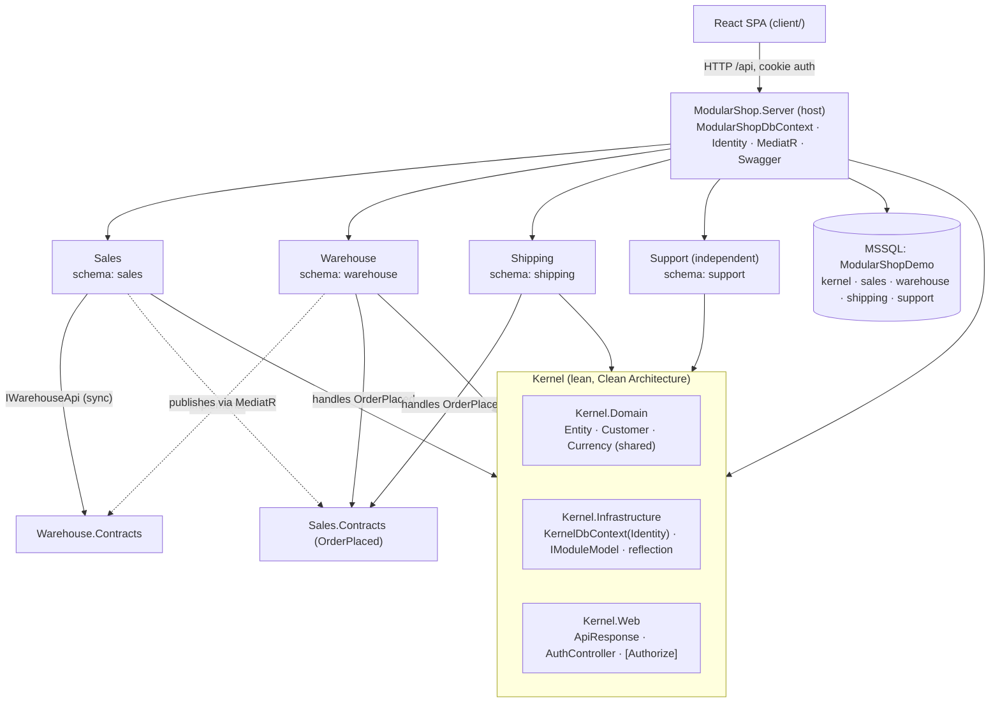
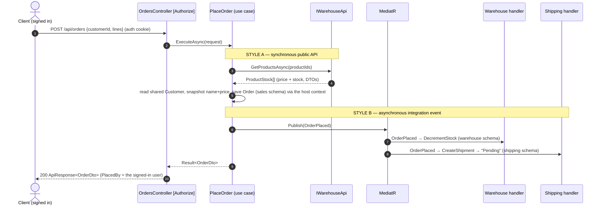

# Architecture — the Modular Monolith concepts this example teaches

ModularShop is deliberately small, but every part exists to demonstrate one Modular Monolith (MM)
concept **correctly**. This document explains each concept, points at the exact code, and shows the
module map and the order→shipment flow as diagrams.

> A **Modular Monolith** is a *single deployable unit* whose internals are split into loosely‑coupled,
> highly‑cohesive **modules organised by business capability**. Each module owns its data and exposes a
> small public contract; everything else is hidden. You get microservice‑style boundaries (high
> cohesion, low coupling, data ownership) with monolith simplicity (in‑process calls, one database,
> simple deployment).

This example uses **one host DbContext built from per‑module blueprints** ("Option B"): each module
still declares its own `DbContext`, but only as an organisational *blueprint* — at runtime a single
host context absorbs them all, owns the (centralised) migrations, and is the only context services
ever touch. This is the design chosen for migrating the real `../Platform` solution.

The concepts, and where each lives:

| Concept | Where to look |
|---|---|
| 1. Encapsulation & enforced boundaries | module projects + `*.Contracts` + the project‑reference graph |
| 2. Clean Architecture **inside** each module | `*.Domain / *.Application / *.Infrastructure / *.Api` |
| 3. One **host context** from per‑module **blueprints** | `IModuleModel`, `ModuleModelBuilder`, `ModularShopDbContext` |
| 4. Schema‑per‑module + **centralised migrations** | `ApplyModuleSchemas`, `ModularShop.Server/Migrations` |
| 5. Composition root / bootstrapper | `Program.cs`, `HostModules`, `IModule`, ApplicationParts |
| 6. The shared **Kernel**: Identity + shared entities + cross‑cutting | `Kernel.Domain/.Application/.Infrastructure/.Web` |
| 7. Two inter‑module communication styles | `IWarehouseApi` (sync) and `OrderPlaced` + MediatR (async) |
| 8. A **genuinely independent** module | `Support` (tickets — no events, no cross‑module calls) |

---

## 1. Encapsulation & enforced boundaries

A module’s domain is **hidden**. The only thing a module exposes to the outside is the public surface
in its `*.Contracts` project. The boundary is enforced by the **project‑reference graph**: no module
references another module’s `Domain / Application / Infrastructure / Api` — it may reference only the
Kernel and other modules’ `*.Contracts`.

- The public surface is a separate, tiny assembly. `Warehouse.Contracts` contains only `IWarehouseApi`
  + the `ProductStock` DTO; `Sales.Contracts` contains only the `OrderPlaced` event. **Shipping and
  Support have no `.Contracts` project** — nothing calls into them, so they expose no public API.
- Because each layer is its own assembly, `internal` no longer equals "module‑private". Encapsulation
  across modules is instead a **reference‑graph fact**: if Sales does not reference `Warehouse.Domain`,
  it *cannot name* `Product`. Within a module, `internal` still hides genuinely private types (the
  blueprint DbContext, seeds, event handlers).

| Project | May reference |
|---|---|
| `Modules.Sales.*` | Kernel.*, `Sales.Contracts`, `Warehouse.Contracts` |
| `Modules.Warehouse.*` | Kernel.*, `Warehouse.Contracts`, `Sales.Contracts` |
| `Modules.Shipping.*` | Kernel.*, `Sales.Contracts` |
| `Modules.Support.*` | Kernel.* **only** (no other module) |
| `*.Contracts` | nothing (Sales.Contracts uses only `MediatR.Contracts` for the event marker) |
| `ModularShop.Server` (host) | everything |

Because the `*.Contracts` projects depend on (almost) nothing, the reference graph is **acyclic** even
though Sales↔Warehouse and Sales↔Shipping "talk". **Support references no other module at all** — the
clearest demonstration that a module can stand completely alone (see §8).

> **Next step in a real system:** add an architecture test (NetArchTest) that fails the build if a
> module references another module’s implementation assembly — the "tripwire" that turns the reference
> rules into an enforced guarantee. Omitted here per the brief.

---

## 2. Clean Architecture inside each module

Each module is a small Clean‑Architecture stack of **four projects**, dependencies pointing inward:

```
  Api  ───►  Application  ───►  Domain
   │              │
   └────►  Infrastructure  ───► Application, Domain, Kernel
   (host wires Infrastructure + Api together)
```

- **Domain** (`Product`, `Order`, `Shipment`, `Ticket`, …) — entities and rules. No framework deps
  beyond the Kernel’s `Entity` base.
- **Application** — **use cases** (one class per operation: `PlaceOrder`, `ListProducts`,
  `CreateTicket`, …), DTOs, and mappings. Every use case returns an `Ardalis.Result<T>`. A use case
  depends on the base **`DbContext`** and queries with plain LINQ (`db.Set<T>()…`).
- **Infrastructure** — the module’s **blueprint** `DbContext`, the `XModule` class (which is both
  `IModule` and `IModuleModel`), seeding, and the **integration‑event handlers**.
- **Api** — **controllers only**. A controller injects use cases, calls them, and maps the `Result` to
  an `ApiResponse<T>` via the kernel base controller.

The request path is uniform: **Controller → Use case → (repositories + `IUnitOfWork` | `IWarehouseApi` |
MediatR publish)**.

> **Clean Architecture, kept — with our own repositories.** EF Core stays out of the Application layer.
> Use cases depend on repository abstractions — `IReadRepository<T>` / `IRepository<T>` (in
> `Kernel.Domain`) and `IUnitOfWork` (in `Kernel.Application`) — whose implementations live in
> `Kernel.Infrastructure`. Because Option B has one host context, a single open‑generic `Repository<T>`
> over it serves **every** module's entities; a module adds a **specific** repository only where the
> generic one falls short — Support's `ITicketRepository.ListSummariesAsync` projects a message *count*
> in the database (a plain‑LINQ correlated sub‑query) instead of loading every message body. Reads are
> materialised and async (with typed *and* string includes), so the Application layer never touches EF
> Core's `IQueryable`. `SaveChanges` is the `IUnitOfWork`'s job, not the repository's, so a use case owns
> its transaction boundary. `Ardalis.Specification` was removed (it isn't needed); `Ardalis.Result` stays.

---

## 3. One host context, built from per‑module *blueprints*

This is the centrepiece of the design. Every module keeps its **own** `DbContext` — but purely as a
*blueprint*: a self‑contained place to declare which entities the module owns.

```csharp
// Sales.Infrastructure/Persistence/SalesDbContext.cs — a BLUEPRINT, never instantiated at runtime.
internal sealed class SalesDbContext : DbContext
{
    public SalesDbContext(DbContextOptions<SalesDbContext> options) : base(options) { }
    public DbSet<Order> Orders => Set<Order>();   // declares "Sales owns Order"
}
```

At runtime there is exactly **one** context — `ModularShopDbContext` in the host — and it *absorbs*
every module’s blueprint. Each `XModule` implements `IModuleModel`:

```csharp
public interface IModuleModel
{
    string Schema { get; }                       // e.g. "sales"
    Type ContextType { get; }                    // typeof(SalesDbContext) — its DbSets are the entities
    void Configure(ModelBuilder modelBuilder);   // the ONE place for special mapping (relationships, FKs, indexes)
}
```

The host context asks each contributor to build its slice of the model. `ApplyModuleModel`
**reflects** the blueprint’s `DbSet<T>` properties to register the module’s "ordinary" entities
automatically (table = the DbSet property name), then calls the module’s `Configure` for anything the
plain DbSets can’t express:

```csharp
// ModularShop.Server/Persistence/ModularShopDbContext.cs
protected override void OnModelCreating(ModelBuilder modelBuilder)
{
    base.OnModelCreating(modelBuilder);                 // Identity + shared kernel entities (§6)
    foreach (var module in _modules)
        modelBuilder.ApplyModuleModel(module);          // reflect DbSets + module.Configure(...)
    modelBuilder.ApplyModuleSchemas(_modules, KernelSchema); // place every table in its owner's schema
}
```

Why this shape?

- **Context‑per‑module for organisation, one context for runtime.** Each module has an obvious,
  self‑contained place to declare its tables (its blueprint + one `Configure` method — *no per‑entity
  configuration classes*). But services, transactions, and migrations all deal with a **single**
  context, so there’s no "which context do I inject?" and no cross‑context transaction problem.
- **The host owns no entity knowledge.** It never names `Order` or `Product`; it just asks each
  registered `IModuleModel` to contribute. Adding a module changes no host code (see §5).
- **Reflection means the DbSets are the recipe.** You don’t list a module’s entities twice — declaring
  `DbSet<Order>` on the blueprint is enough for the host to register it.

---

## 4. Schema‑per‑module (one database, one schema each) + centralised migrations

All modules share **one MSSQL database** (`ModularShopDemo`); each module’s tables live in its **own
schema**. Because there is a single context, schema placement is assigned **per entity** after the
model is built, by the assembly each entity type lives in:

```csharp
// ModuleModelBuilder.ApplyModuleSchemas — every entity goes to its owner's schema; the rest → "kernel".
foreach (var entityType in modelBuilder.Model.GetEntityTypes())
    entityType.SetSchema(ownerSchemaByAssembly.GetValueOrDefault(entityType.ClrType.Assembly, kernelSchema));
```

Because a module’s entities all live in its Domain assembly, child entities reached only through a
navigation — `OrderLine`, `ShipmentItem`, `TicketMessage` — are placed correctly **without being
listed anywhere**. Anything not owned by a module (the shared kernel entities and every Identity table)
falls into the `kernel` schema.

**Migrations are centralised.** There is **one** migration chain, owned by the host
(`ModularShop.Server/Migrations`), generated with the official `dotnet ef` tool against
`ModularShopDbContext`. A design‑time factory (`ModularShopDbContextFactory`) builds the host context
with the same module list the runtime uses, so one `migrations add` covers every module’s tables.

Verified layout in the running database:

```
kernel.AspNetUsers  kernel.AspNetRoles  kernel.AspNet* …   kernel.Customers   kernel.Currencies
sales.Orders        sales.OrderLines
warehouse.Products
shipping.Shipments  shipping.ShipmentItems
support.Tickets     support.TicketMessages
dbo.__EFMigrationsHistory        ← one centralised history table
```

The rule this still enforces: **a module never reaches into another module’s tables.** When Sales needs
data Warehouse owns, it asks through Warehouse’s API (§7) and **snapshots** what it needs — see
`OrderLine` storing `ProductName`/`UnitPrice` copies with *no* FK to `warehouse.Products`. The **only**
cross‑schema foreign keys point at the **shared kernel** entities (§6), which is exactly what makes
them "shared".

> **Next step:** to extract a module into its own database, its blueprint already isolates its entities;
> the shared‑kernel FKs are the one thing you’d replace with a contract/bus call first.

---

## 5. Composition root / module bootstrapper

The host project `ModularShop.Server` is the **composition root**. It contains **no business logic** —
it wires modules through two small contracts. Each `XModule` implements **both**:

```csharp
public interface IModule            // its own services
{ string Name { get; } void Register(IServiceCollection services, IConfiguration configuration); }

public interface IModuleModel       // its slice of the single host model (§3)
{ string Schema { get; } Type ContextType { get; } void Configure(ModelBuilder modelBuilder); }
```

`HostModules` is the single place that knows the full set of modules (used by both `Program.cs` and the
design‑time migration factory, so they never drift). `Program.cs` drives the lifecycle:

```csharp
var modules = HostModules.All();   // [ Sales, Warehouse, Shipping, Support ]

// ONE host context; the repositories + unit of work resolve the base DbContext, aliased to it.
builder.Services.AddDbContext<ModularShopDbContext>(o => o.UseSqlServer(cs));
builder.Services.AddScoped<DbContext>(sp => sp.GetRequiredService<ModularShopDbContext>());

// One open-generic Repository<T> serves every module's entities; UnitOfWork commits.
builder.Services.AddScoped(typeof(IReadRepository<>), typeof(Repository<>));
builder.Services.AddScoped(typeof(IRepository<>), typeof(Repository<>));
builder.Services.AddScoped<IUnitOfWork, UnitOfWork>();

// ASP.NET Core Identity (kernel concern), stored in the host context, cookie auth (§6).
builder.Services.AddIdentity<ApplicationUser, ApplicationRole>(…).AddEntityFrameworkStores<ModularShopDbContext>();

builder.Services.AddMediatR(cfg => cfg.RegisterServicesFromAssemblies(/* each module's Infrastructure */));

builder.Services.AddControllers()
    .AddApplicationPart(typeof(AuthController).Assembly)      // kernel auth endpoints
    .AddApplicationPart(typeof(SalesApiAssembly).Assembly)   // …and each module's Api
    /* Warehouse, Shipping, Support */;

foreach (var module in modules) {
    builder.Services.AddSingleton<IModule>(module);
    builder.Services.AddSingleton<IModuleModel>((IModuleModel)module);   // the host context injects these
    module.Register(builder.Services, builder.Configuration);
}
builder.Services.AddScoped<IModuleInitializer, KernelSeeder>();          // Order = 0 → runs first

// startup: migrate the single database ONCE, then run every seeder in Order.
await db.Database.MigrateAsync();
foreach (var init in scope.ServiceProvider.GetServices<IModuleInitializer>().OrderBy(i => i.Order))
    await init.InitializeAsync();
```

Each module’s `Register` wires only its own use cases, public API and seeder — **not** a DbContext (the
host owns the one context). Controllers live in the Api project and are discovered as MVC
**ApplicationParts**. **Adding a feature = create the module’s projects and add one line to
`HostModules`.**

Note the **centralised startup**: the host migrates once, then each `IModuleInitializer` only *seeds*
(through the shared context), ordered so the kernel’s customers/currencies exist before a module seeds
orders that reference them.

---

## 6. The shared Kernel — Identity, shared entities, and cross‑cutting code

The kernel holds everything **shared across modules** — and nothing module‑specific. It is split into
four Clean‑Architecture layers so its own dependencies point inward.

| Project | Layer | Contents |
|---|---|---|
| `Kernel.Domain` | Domain | `Entity`, and the **shared entities** `Customer`, `Currency` |
| `Kernel.Application` | Application | `ICurrentUser` |
| `Kernel.Infrastructure` | Infrastructure | `ApplicationUser`/`ApplicationRole`, `KernelDbContext : IdentityDbContext`, `IModuleModel` + `ModuleModelBuilder` (reflection/schema), `IModule`, `IModuleInitializer`, `KernelSeeder` |
| `Kernel.Web` | Web | `ApiResponse`, `ApiControllerBase` (`[Authorize]` + maps `Result`→`ApiResponse`), `AuthController`, `CurrentUser`, exception middleware |

Two things the kernel now owns are worth calling out:

**Shared entities (for consistency across modules).** `Customer` and `Currency` live in the kernel
because *more than one module* uses each, and they must stay consistent. `Customer` is referenced by
**Sales** (orders), **Shipping** (deliveries) and **Support** (tickets); `Currency` by **Warehouse**
(product prices) and **Sales** (order currency). Centralising them here — rather than each module
keeping its own copy — is what guarantees one consistent customer/currency across the whole system.
Modules link to them with real (cross‑schema) foreign keys; that FK is the deliberate signal "this is
shared kernel data", as opposed to another module’s *private* data (which you reach only via a contract).

**Authentication (a cross‑cutting concern).** ASP.NET Core Identity lives in the kernel. `KernelDbContext`
derives from `IdentityDbContext<ApplicationUser, ApplicationRole, string>`, so the single host context
owns the Identity tables (in the `kernel` schema). `AuthController` (register / login / logout / me)
uses cookie sign‑in; `ApiControllerBase` carries `[Authorize]`, so **every** module endpoint requires
an authenticated user, and use cases read the current user only through the kernel’s `ICurrentUser`
abstraction (`PlaceOrder` stamps `Order.PlacedBy`; `CreateTicket` stamps the ticket’s author).

> Keep the kernel **lean**: shared *reference* entities (Customer, Currency) and cross‑cutting infra
> belong here; a module’s own business entities do **not**. An over‑fat kernel re‑couples the modules
> through the back door — the exact problem this design avoids.

---

## 7. The two inter‑module communication styles

Modules never read each other’s tables. When they must interact, they use one of two explicit styles.

**Style A — Synchronous, through a module’s public interface.** Used when the caller needs an answer
*now*. Placing an order, Sales calls Warehouse’s public API for current price and stock:

```csharp
// Warehouse.Contracts:  interface IWarehouseApi { Task<IReadOnlyList<ProductStock>> GetProductsAsync(...); }
// Warehouse.Application: sealed class WarehouseApi : IWarehouseApi { /* queries db.Set<Product>() */ }
// Sales.Application:     injects IWarehouseApi — never sees WarehouseApi, Product, or a Warehouse table.
```

Return **DTOs, not entities**. This is real, explicit coupling (both modules must be present), exactly
right for "give me data now".

**Style B — Asynchronous, through an integration event.** Used for "this happened; whoever cares can
react". After the order commits, `PlaceOrder` publishes `OrderPlaced` (a MediatR `INotification` in
`Sales.Contracts`). Sales does **not** know who handles it. Two modules independently do:

- `Warehouse/…/DecrementStockOnOrderPlaced` → the `DecrementStock` use case (warehouse schema).
- `Shipping/…/CreateShipmentOnOrderPlaced` → the `CreateShipment` use case (shipping schema).

Because there is a single host context, these handlers run in the same request scope on the **same**
context — so the whole flow shares one change tracker.

**Rule of thumb:** need a value back now → Style A (interface). Fire‑and‑forget "it happened" → Style B
(event). Integration events are part of a module’s public contract — keep them small and stable.

> **Next step:** the in‑memory bus loses events if the process crashes mid‑handling. The production
> upgrade is a transactional **outbox**; the publish call would not change.

---

## 8. A genuinely independent module: Support

Sales, Warehouse and Shipping collaborate (that’s what makes them a good test of *clean* boundaries).
**Support is the opposite on purpose:** customer‑service tickets are unrelated to the order → stock →
ship flow, so Support:

- references **no** other module (see the table in §1) and publishes/consumes **no** integration events;
- has **no** `*.Contracts` project — nothing calls into it;
- uses **only the kernel** — the shared `Customer` (a ticket is raised for one) and the signed‑in
  Identity user (recorded as the ticket’s author);
- owns its own `support` schema (`Tickets`, `TicketMessages`) like every other module.

This proves the design handles a **heterogeneous** module set: modules that must collaborate *and*
modules that simply coexist. The one thing Support shares — `Customer` — it shares through the **kernel**,
never by reaching into Sales. That is the pattern for the real Platform, whose modules range from tightly
related to completely independent.

---

## Module & dependency map



The host owns the **one** context; modules contribute blueprints. Cross‑schema FKs exist **only** to
the `kernel` schema (Customer, Currency).

## The order → shipment flow



`PlaceOrder`, both handlers, and the seeders all share the **one** host `DbContext`.

---

## What we deliberately deferred (and where it would go)

- **Transactional outbox/inbox** for reliable events → behind the MediatR publish in `PlaceOrder`.
- **Architecture tests** (the "tripwire" that a module can’t reference another’s implementation) → a
  NetArchTest project. Omitted per the brief.
- **A startup check that every enabled module’s entities are actually mapped** → a small assertion over
  `ModularShopDbContext.Model` after build. Omitted here.
- **Database‑per‑module** → a module’s blueprint already isolates its entities; the shared‑kernel FKs are
  what you’d convert to contract/bus calls first.
- **CQRS command/query bus** → out of scope. MediatR is used **only** for integration events.

See [`decision-log.md`](./decision-log.md) for *why* each choice was made and what alternatives were
weighed, and [`platform-mapping.md`](./platform-mapping.md) for how this maps back to the Platform
solution.
