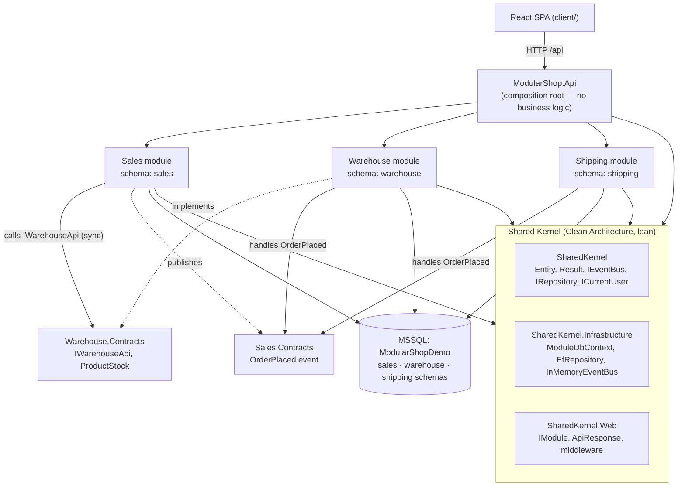
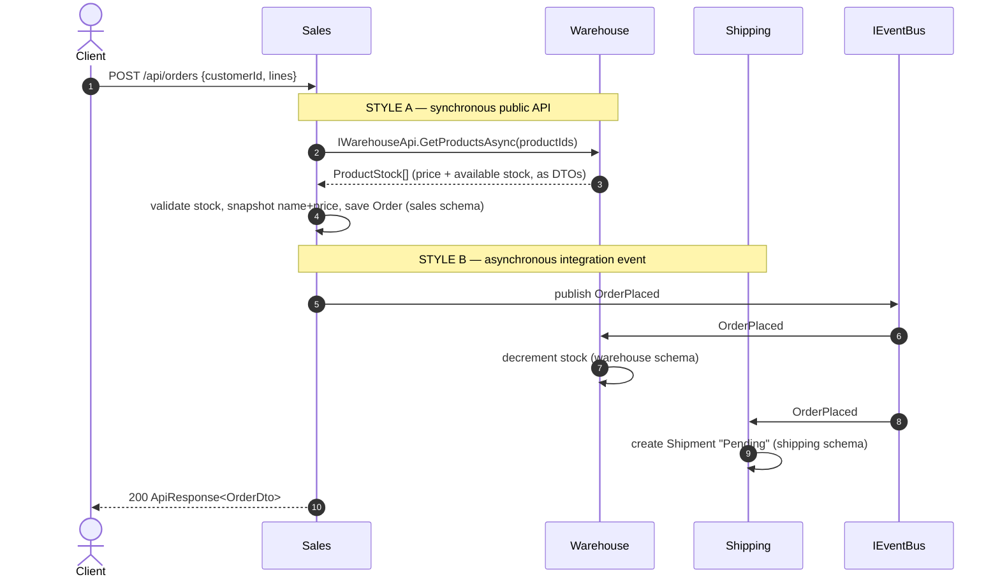

# Architecture — the Modular Monolith concepts this example teaches

ModularShop is deliberately small, but every part exists to demonstrate one Modular Monolith (MM)
concept **correctly**. This document explains each concept, points at the exact code, and shows the
module map and the order→shipment flow as diagrams.

> A **Modular Monolith** is a *single deployable unit* whose internals are split into loosely‑coupled,
> highly‑cohesive **modules organised by business capability**. Each module owns its data and exposes
> a small public contract; everything else is hidden. You get microservice‑style boundaries (high
> cohesion, low coupling, data ownership) with monolith simplicity (in‑process calls, one database,
> simple deployment).

The five concepts, and where each lives:

| Concept | Where to look |
|---|---|
| 1. Encapsulation & enforced boundaries | module projects + `*.Contracts` + `internal` types |
| 2. Schema‑per‑module | `ModuleDbContext`, `UseModuleSqlServer`, per‑module `Migrations/` |
| 3. Composition root / bootstrapper | `ModularShop.Api/Program.cs`, `IModule` |
| 4. Shared kernel (Clean Architecture) | `SharedKernel`, `SharedKernel.Infrastructure`, `SharedKernel.Web` |
| 5. Two inter‑module communication styles | `IWarehouseApi` (sync) and `OrderPlaced` + `IEventBus` (async) |

---

## 1. Encapsulation & enforced boundaries

A module’s domain is **hidden**. The only things a module exposes to the outside are the public types
in its `*.Contracts` project. Everything else — entities, `DbContext`, services, endpoints — is
`internal`, so it is **invisible to other modules at compile time**.

- Domain entities are `internal`: e.g. `Modules/Warehouse/.../Domain/Product.cs` (`internal sealed class Product`).
  If Sales tried to use `Product`, it **would not compile**.
- The public surface is a separate assembly: `Modules/Warehouse/ModularShop.Modules.Warehouse.Contracts`
  contains only `IWarehouseApi` + the `ProductStock` DTO. That is *all* the rest of the system can see
  of Warehouse.
- The boundary is enforced by **project references**. A module may reference **only** the Shared Kernel
  and other modules’ `*.Contracts` — never another module’s implementation:

| Project | May reference |
|---|---|
| `Modules.Sales` | SharedKernel*, `Sales.Contracts`, `Warehouse.Contracts` |
| `Modules.Warehouse` | SharedKernel*, `Warehouse.Contracts`, `Sales.Contracts` |
| `Modules.Shipping` | SharedKernel*, `Sales.Contracts` |
| `*.Contracts` | SharedKernel (core) only |
| `ModularShop.Api` (host) | everything |

Because the `*.Contracts` projects depend on nothing but the kernel, the reference graph is **acyclic**
even though Sales↔Warehouse and Sales↔Shipping "talk" to each other.

Note also that **Shipping has no `.Contracts` project**: nothing calls into Shipping, so it exposes no
public API. Not every module needs one — a useful thing to see.

> **Next step in a real system:** add an architecture test (NetArchTest / NsDepCop) that fails the build
> if a module references another module’s implementation assembly. We omit test projects here per the
> brief, but the reference rules above already make the boundary a compile‑time fact.

---

## 2. Schema‑per‑module (one database, one schema each)

All modules share **one MSSQL database** (`ModularShopDemo`), but each module owns its **own schema**
and its **own `DbContext`**. No module can see another module’s tables.

- Each context derives from `SharedKernel.Infrastructure/Persistence/ModuleDbContext.cs`, which calls
  `modelBuilder.HasDefaultSchema(Schema)` — so `SalesDbContext` → `sales`, `WarehouseDbContext` →
  `warehouse`, `ShippingDbContext` → `shipping`.
- Each module owns its **own EF migrations** (`Modules/*/Migrations/`), generated with the official
  `dotnet ef` tool.
- Even the migrations‑history bookkeeping is per‑module: `UseModuleSqlServer(cs, "sales")` puts each
  context’s `__EFMigrationsHistory` **in its own schema**, so nothing lands in the shared `dbo`.

Verified layout in the running database:

```
sales.__EFMigrationsHistory   sales.Customers   sales.Orders   sales.OrderLines
warehouse.__EFMigrationsHistory   warehouse.Products
shipping.__EFMigrationsHistory   shipping.Shipments   shipping.ShipmentItems
```

The single most important rule this enforces: **a module never shares a `DbContext` and never reaches
into another module’s tables.** When Sales needs data Warehouse owns, it asks through Warehouse’s API
(§5) and **snapshots** what it needs into its own schema — see `OrderLine` storing `ProductName` and
`UnitPrice` copies, with *no* foreign key to `warehouse.Products`.

> **Next step:** if a module ever needs independent scaling or extraction into a microservice, promote
> its schema to its own database — the code barely changes because it already has its own context.

---

## 3. Composition root / module bootstrapper

The host project `ModularShop.Api` is the **composition root**. It contains **no business logic** — it
just wires modules together through the `IModule` contract
(`SharedKernel.Web/IModule.cs`):

```csharp
public interface IModule
{
    string Name { get; }
    void Register(IServiceCollection services, IConfiguration configuration); // its own services + DbContext
    void MapEndpoints(IEndpointRouteBuilder endpoints);                       // its own HTTP endpoints
}
```

`Program.cs` holds the entire module list in one readable place and drives the lifecycle:

```csharp
IReadOnlyList<IModule> modules = [ new SalesModule(), new WarehouseModule(), new ShippingModule() ];

foreach (var module in modules) module.Register(builder.Services, builder.Configuration);
// ...build app...
foreach (var initializer in scope.ServiceProvider.GetServices<IModuleInitializer>())
    await initializer.InitializeAsync();   // each module migrates + seeds ITS OWN schema
foreach (var module in modules) module.MapEndpoints(app);
```

Each module registers its own services and DbContext (`SalesModule.Register`, etc.) and migrates/seeds
its own schema via an `IModuleInitializer`. **Adding a feature = create a module project and add one
line to that list.** (Some MM samples auto‑discover modules by reflection; we keep an explicit list so
the wiring is obvious to a reader.)

---

## 4. The Shared Kernel (itself Clean Architecture)

The shared kernel holds only **cross‑cutting primitives and infrastructure** — never business logic —
and is split into three Clean‑Architecture layers so its own dependencies point inward. This mirrors
the role of `TNEX.Core` / `TNEX.Infrastructure` / `TNEX.Api` in the Platform solution.

| Project | Layer | Contents | Dependencies |
|---|---|---|---|
| `SharedKernel` | Domain/core | `Entity`, `Result`/`Result<T>`, `IIntegrationEvent`, `IEventBus`, `IIntegrationEventHandler`, `IRepository`, `ICurrentUser` | none (pure) |
| `SharedKernel.Infrastructure` | Infrastructure | `ModuleDbContext`, `EfRepository`, `InMemoryEventBus`, `UseModuleSqlServer`, `IModuleInitializer` | EF Core, core |
| `SharedKernel.Web` | Web | `IModule`, `ApiResponse`, `ExceptionHandlingMiddleware`, `CurrentUser`, `ToHttpResult` | ASP.NET Core, core |

Cross‑cutting concerns like **logging** (`ExceptionHandlingMiddleware`, `ILogger`) and **identity**
(`ICurrentUser`, read from a request header for the demo) live here — the correct home for them in an
MM. Keep the kernel **lean**: an over‑fat kernel re‑couples the modules through the back door.

---

## 5. The two inter‑module communication styles

This is the heart of the example. One realistic flow uses **both** styles.

**Style A — Synchronous, through a module’s public interface.** Used when the caller needs an answer
*now*. When placing an order, Sales must know the current price and stock, so it calls Warehouse’s
public API:

```csharp
// Warehouse.Contracts (public):     interface IWarehouseApi { Task<IReadOnlyList<ProductStock>> GetProductsAsync(...); }
// Warehouse (internal impl):         internal sealed class WarehouseApi : IWarehouseApi { /* queries its own DbContext */ }
// Sales (consumer):                  injected IWarehouseApi — never sees WarehouseApi, Product, or WarehouseDbContext.
```

Return **DTOs, not entities**, and shape the API around use cases. This is real, explicit coupling
(both modules must be present), which is exactly right for "give me data now".

**Style B — Asynchronous, through an integration event.** Used for "this happened; whoever cares can
react". After the order commits, Sales publishes `OrderPlaced` (in `Sales.Contracts`) on the in‑process
`IEventBus`. Sales does **not** know who handles it. Two modules independently do:

- `Warehouse/…/DecrementStockOnOrderPlaced` → decrements stock in the `warehouse` schema.
- `Shipping/…/CreateShipmentOnOrderPlaced` → creates a `Pending` shipment in the `shipping` schema.

The bus (`SharedKernel.Infrastructure/Messaging/InMemoryEventBus.cs`) is ~30 lines: it resolves every
registered `IIntegrationEventHandler<OrderPlaced>` from DI and invokes them. You can read the whole
mechanism — nothing is hidden behind a library.

**Rule of thumb:** need a value back now → Style A (interface). Fire‑and‑forget "it happened" → Style B
(event). Integration events are part of a module’s public contract, so keep them small and stable.

> **Next step:** the in‑memory bus loses events if the process crashes mid‑handling. The production
> upgrade is a transactional **outbox** (persist the event in the same transaction as the order, then a
> background worker publishes it). The `IEventBus` interface would not change — that is the payoff of
> programming to the interface.

---

## Module & dependency map



## The order → shipment flow



A later `POST /api/shipments/{id}/ship` advances a shipment `Pending → Shipped` (and `…/deliver` →
`Delivered`), showing a module owning and driving its own state.

---

## What we deliberately deferred (and where it would go)

These are real production concerns, intentionally left out to keep the fundamentals visible. Each has a
natural home in this structure:

- **Transactional outbox/inbox** for reliable events → behind `IEventBus`.
- **Architecture tests** enforcing boundaries → a test project asserting reference rules.
- **Real authentication** (JWT/OIDC) → behind `ICurrentUser` in `SharedKernel.Web`.
- **Database‑per‑module** → change one module’s connection string; its context already isolates it.
- **A CQRS command/query bus / MediatR** → optional; our services + the hand‑rolled event bus already
  demonstrate the patterns without the extra machinery (and MediatR is commercially licensed since 2025).

See [`decision-log.md`](./decision-log.md) for *why* each choice was made and what alternatives were
weighed, and [`platform-mapping.md`](./platform-mapping.md) for how this maps back to the Platform
solution.
