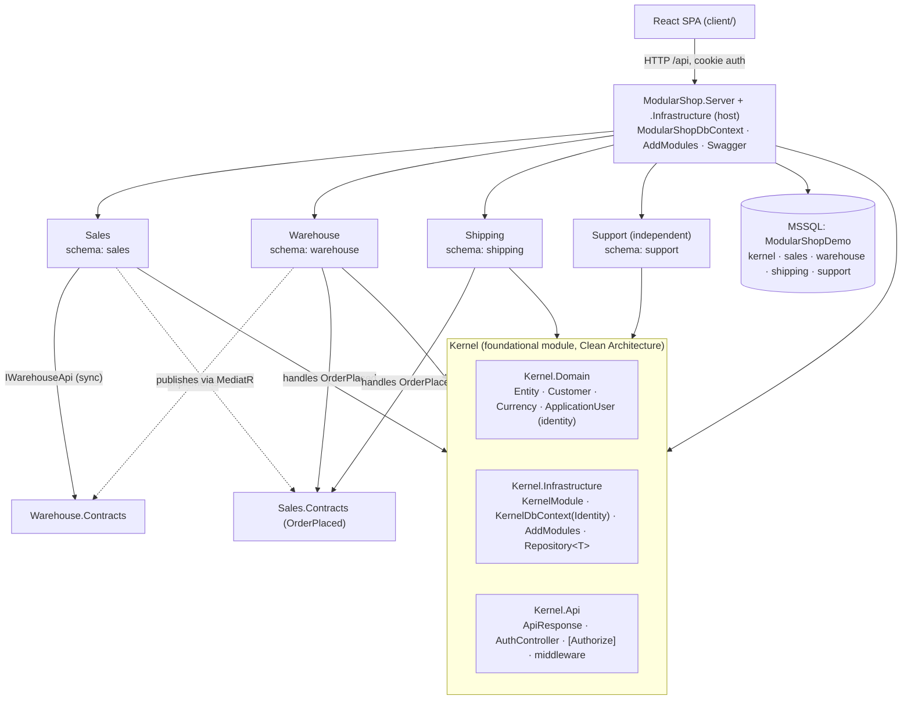
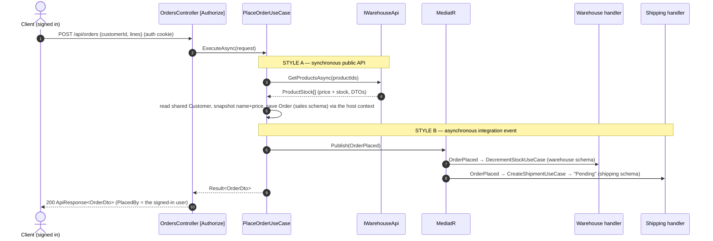

# Architecture — the Modular Monolith concepts this example teaches

ModularShop is deliberately small, but every part exists to demonstrate one Modular Monolith (MM)
concept **correctly**. This document explains each concept, points at the exact code, and shows the
module map and the order→shipment flow as diagrams.

> A **Modular Monolith** is a *single deployable unit* whose internals are split into loosely‑coupled,
> highly‑cohesive **modules organised by business capability**. Each module owns its data and exposes a
> small public contract; everything else is hidden. You get microservice‑style boundaries (high
> cohesion, low coupling, data ownership) with monolith simplicity (in‑process calls, one database,
> simple deployment).

This example uses **one host DbContext composed from per‑module contexts**: each module owns an ordinary
`DbContext`, and at runtime a single host context harvests each module's model (by invoking its
`OnModelCreating` via reflection), owns the (centralised) migrations, and is the only context services
ever touch. The **kernel is itself a module**, and modules are **discovered dynamically** and selected
by configuration. This is the design chosen for migrating the real `../Platform` solution.

The concepts, and where each lives:

| Concept | Where to look |
|---|---|
| 1. Encapsulation & enforced boundaries | module projects + `*.Contracts` + the project‑reference graph |
| 2. Clean Architecture **inside** each module | `*.Domain / *.Application / *.Infrastructure / *.Api` |
| 3. One **host context** from per‑module contexts (reflection) | `ModuleModelComposition.ApplyModuleModels`, `ModularShopDbContext` |
| 4. Schema‑per‑module + **centralised migrations** | each module's `ToTable(name, schema)`, `ModularShop.Infrastructure/Migrations` |
| 5. Composition root / bootstrapper (dynamic discovery) | `Program.cs`, `ModuleRegistration.AddModules`, `IModule` |
| 6. The shared **Kernel**: Identity + shared entities + cross‑cutting | `Kernel.Domain/.Application/.Infrastructure/.Api` |
| 7. Two inter‑module communication styles | `IWarehouseApi` (sync) and `OrderPlaced` + MediatR (async) |
| 8. A **genuinely independent** module | `Support` (tickets — no events, no cross‑module calls) |

---

## 1. Encapsulation & enforced boundaries

A module’s domain is **hidden**. The only thing a module exposes to the outside is the public surface
in its `*.Contracts` project. The boundary is enforced by the **project‑reference graph**: no module
references another module’s `Domain / Application / Infrastructure / Api` — it may reference only the
Kernel and other modules’ `*.Contracts`.

- The public surface is a separate, tiny assembly. `Warehouse.Contracts` contains only `IWarehouseApi`
  + the `ProductStock` DTO; `Sales.Contracts` contains only the `OrderPlaced` event. **Shipping and
  Support have no `.Contracts` project** — nothing calls into them, so they expose no public API.
- Because each layer is its own assembly, `internal` no longer equals "module‑private". Encapsulation
  across modules is instead a **reference‑graph fact**: if Sales does not reference `Warehouse.Domain`,
  it *cannot name* `Product`. Within a module, `internal` still hides genuinely private types (seeds,
  event handlers, mapping details).

| Project | May reference |
|---|---|
| `Modules.Sales.*` | Kernel.*, `Sales.Contracts`, `Warehouse.Contracts` |
| `Modules.Warehouse.*` | Kernel.*, `Warehouse.Contracts`, `Sales.Contracts` |
| `Modules.Shipping.*` | Kernel.*, `Sales.Contracts` |
| `Modules.Support.*` | Kernel.* **only** (no other module) |
| `*.Contracts` | nothing (Sales.Contracts uses only `MediatR.Contracts` for the event marker) |
| `ModularShop.Server` + `ModularShop.Infrastructure` (host) | everything |

Because the `*.Contracts` projects depend on (almost) nothing, the reference graph is **acyclic** even
though Sales↔Warehouse and Sales↔Shipping "talk". **Support references no other module at all** — the
clearest demonstration that a module can stand completely alone (see §8).

> **Next step in a real system:** add an architecture test (NetArchTest) that fails the build if a
> module references another module’s implementation assembly — the "tripwire" that turns the reference
> rules into an enforced guarantee. Omitted here per the brief.

---

## 2. Clean Architecture inside each module

Each module is a small Clean‑Architecture stack of **four projects**, dependencies pointing inward:

```
  Api  ───►  Application  ───►  Domain
   │              │
   └────►  Infrastructure  ───► Application, Domain, Kernel
   (host wires Infrastructure + Api together)
```

- **Domain** (`Product`, `Order`, `Shipment`, `Ticket`, …) — entities and rules. No framework deps
  beyond the Kernel’s `Entity` base.
- **Application** — **use cases** (one class per operation: `PlaceOrderUseCase`, `ListProductsUseCase`,
  `CreateTicketUseCase`, …), DTOs, and mappings. Every use case inherits `UseCase` and returns an
  `Ardalis.Result<T>`. A use case depends on the repository abstractions (`IReadRepository<T>` /
  `IRepository<T>`) + `IUnitOfWork`, never on EF Core directly (see the note below).
- **Infrastructure** — the module’s `DbContext`, the `XModule` class (its `IModule`), seeding, and the
  **integration‑event handlers**.
- **Api** — **controllers only**. A controller injects use cases, calls them, and maps the `Result` to
  an `ApiResponse<T>` via the kernel base controller.

The request path is uniform: **Controller → Use case → (repositories + `IUnitOfWork` | `IWarehouseApi` |
MediatR publish)**.

> **Clean Architecture, kept — with our own repositories.** EF Core stays out of the Application layer.
> Use cases depend on repository abstractions — `IReadRepository<T>` / `IRepository<T>` (in
> `Kernel.Domain`) and `IUnitOfWork` (in `Kernel.Application`) — whose implementations live in
> `Kernel.Infrastructure`. Because there is one host context, a single open‑generic `Repository<T>`
> over it serves **every** module's entities; a module adds a **specific** repository only where the
> generic one falls short. Support's `ITicketSummaryQuery.ListAsync` — NOT a repository — projects a message
> *count* in the database (a plain‑LINQ correlated sub‑query) instead of loading every message body. Reads are
> materialised and async (with typed, compile‑time‑safe includes), so the Application layer never touches
> EF Core's `IQueryable`. `SaveChanges` is the `IUnitOfWork`'s job, not the repository's, so a use case owns
> its transaction boundary. **Repositories only ever return entities** — a read shape that isn't an entity
> (e.g. Support's ticket list, a header‑plus‑message‑count projection) is a separate, dedicated read‑only
> query object (`ITicketSummaryQuery`), not a repository method; the use case maps its result to the
> API‑facing DTO. `Ardalis.Specification` was removed (it isn't needed); `Ardalis.Result` stays.

---

## 3. One host context, composed from per‑module DbContexts

This is the centrepiece of the design. Every module owns an **ordinary** `DbContext` that declares and
configures its entities — exactly like a standalone app's context — but the host never registers or
connects it. At runtime there is exactly **one** context, `ModularShopDbContext`, and it *composes* its
model from all the module contexts.

```csharp
// Sales.Infrastructure/Persistence/SalesDbContext.cs — a normal DbContext; the host harvests its model.
public sealed class SalesDbContext : DbContext
{
    public const string Schema = "sales";
    public SalesDbContext(DbContextOptions options) : base(options) { }
    public DbSet<Order> Orders => Set<Order>();

    protected override void OnModelCreating(ModelBuilder modelBuilder)
    {
        modelBuilder.Entity<Order>(order =>
        {
            order.ToTable("Orders", Schema);                            // the module owns its schema
            order.HasOne<Customer>().WithMany().HasForeignKey(o => o.CustomerId);  // cross-schema FK to the kernel
            order.HasMany(o => o.Lines).WithOne().HasForeignKey(l => l.OrderId);   // its child, relationships, indexes
        });
        modelBuilder.Entity<OrderLine>(line => line.ToTable("OrderLines", Schema));
    }
}
```

The host context holds **no** entity knowledge. Its `OnModelCreating` asks each registered module to
layer its own model onto the one shared `ModelBuilder`:

```csharp
// ModularShop.Infrastructure/Persistence/ModularShopDbContext.cs
public sealed class ModularShopDbContext : DbContext
{
    private readonly IReadOnlyList<IModule> _modules;   // injected — the config-selected set (§5)
    public ModularShopDbContext(DbContextOptions<ModularShopDbContext> o, IEnumerable<IModule> modules)
        : base(o) => _modules = modules.ToList();

    protected override void OnModelCreating(ModelBuilder modelBuilder)
        => this.ApplyModuleModels(modelBuilder, _modules);
}
```

`ApplyModuleModels` (in the kernel) is the whole mechanism: for each module — the kernel first — it
instantiates the module’s `DbContext` with throwaway options (never connected) and invokes its
**protected** `OnModelCreating` by reflection, onto the shared builder:

```csharp
// Kernel.Infrastructure/Persistence/ModuleModelComposition.cs
public static void ApplyModuleModels(this DbContext host, ModelBuilder modelBuilder, IEnumerable<IModule> modules)
{
    foreach (var module in modules.OrderByDescending(m => m.IsFoundational))   // kernel composes first
    {
        var ctx = CreateForModelHarvest(module.ContextType);                  // throwaway UseSqlServer options
        OnModelCreatingOf(module.ContextType).Invoke(ctx, [modelBuilder]);    // the PROTECTED method, by reflection
        (ctx as IDisposable)?.Dispose();
    }
}
```

Why this shape?

- **Context‑per‑module for organisation, one context for runtime.** Each module has an obvious,
  self‑contained `DbContext` to declare and configure its tables — no per‑entity configuration classes,
  no shared marker interface or base class. But services, transactions and migrations all deal with a **single**
  context, so there’s no "which context do I inject?" and no cross‑context transaction problem.
- **The host owns no entity knowledge.** It never names `Order` or `Product`; it just asks each
  registered `IModule` to contribute its context’s model. Adding a module changes no host code (§5).
- **A module context is "just a `DbContext`".** No base class, no marker interface — the reflection call
  is what reaches the protected `OnModelCreating`, so a module context is indistinguishable from an
  ordinary standalone one. (The kernel’s is an `IdentityDbContext`; it composes the same way.)

---

## 4. Schema‑per‑module (one database, one schema each) + centralised migrations

All modules share **one MSSQL database** (`ModularShopDemo`); each module’s tables live in its **own
schema**. Because each module configures its own model (§3), it also **places its own tables**: every
module context calls `ToTable(name, schema)` for its entities (e.g. `order.ToTable("Orders", "sales")`).
The kernel context sets `modelBuilder.HasDefaultSchema("kernel")`, so everything the kernel owns — the
shared entities and every ASP.NET Identity table — and anything a module doesn’t explicitly place falls
into the `kernel` schema.

Child entities reached only through a navigation — `OrderLine`, `ShipmentItem`, `TicketMessage` — are
placed by the same `ToTable(..., Schema)` call in their owner’s `OnModelCreating`; nothing is assigned
"by assembly" or listed centrally.

**Migrations are centralised.** There is **one** migration chain, owned by the host's Infrastructure
project (`ModularShop.Infrastructure/Migrations`), generated with the official `dotnet ef` tool against
`ModularShopDbContext`. No design‑time factory is needed: `dotnet ef` builds the host context from the
app’s own service provider (booting `Program.cs` up to `builder.Build()`), so `AddModules` selects the
same module set the runtime uses. **The composed model is exactly the selected module set** (§5): the
single migration here covers every module because this host enables all of them; a micro‑solution that
enables a subset would generate a migration for that subset.

Verified layout in the running database:

```
kernel.AspNetUsers  kernel.AspNetRoles  kernel.AspNet* …   kernel.Customers   kernel.Currencies
sales.Orders        sales.OrderLines
warehouse.Products
shipping.Shipments  shipping.ShipmentItems
support.Tickets     support.TicketMessages
dbo.__EFMigrationsHistory        ← one centralised history table
```

The rule this still enforces: **a module never reaches into another module’s tables.** When Sales needs
data Warehouse owns, it asks through Warehouse’s API (§7) and **snapshots** what it needs — see
`OrderLine` storing `ProductName`/`UnitPrice` copies with *no* FK to `warehouse.Products`. The **only**
cross‑schema foreign keys point at the **shared kernel** entities (§6), which is exactly what makes
them "shared".

> **Next step:** to extract a module into its own database, its own `DbContext` already isolates its
> entities; the shared‑kernel FKs are the one thing you’d replace with a contract/bus call first.

---

## 5. Composition root / module bootstrapper

The host project `ModularShop.Server` is the **composition root**. It contains **no business logic** and
no module‑specific wiring. Every module — the kernel included — implements one small contract:

```csharp
public interface IModule
{
    string Name { get; }                  // "Sales", "Kernel", …
    Type ContextType { get; }             // the module's DbContext, harvested for the model (§3)
    bool IsFoundational => false;         // the kernel overrides this to true (always loads, composes first)
    void Register(IServiceCollection services, IConfiguration configuration);
}
```

The kernel provides one extension that **discovers, selects and registers** every module:

```csharp
// Kernel.Infrastructure/ModuleRegistration.cs
public static IServiceCollection AddModules(this IServiceCollection services, IConfiguration configuration)
{
    foreach (var module in SelectModules(DiscoverModules(), configuration))
    {
        services.AddSingleton<IModule>(module);        // the host context injects these (§3)
        module.Register(services, configuration);      // the module wires ALL of its own parts
    }
    return services;
}
```

- **Discover** — scan the app’s own `ModularShop.*.dll` assemblies for `IModule` implementations and
  instantiate them. (Scanning the deployed assemblies, not `AppDomain`, is deterministic — referenced
  assemblies load lazily.)
- **Select** — read a `"Modules"` array from configuration: keep the named modules (plus the
  foundational kernel, always); if the key is **absent, keep them all**.
- **Register** — foundational‑first, register each `IModule` and let it register its own services.

So `Program.cs` is tiny:

```csharp
var builder = WebApplication.CreateBuilder(args);
var cs = builder.Configuration.GetConnectionString("ModularShopDemo");

builder.Services.AddDbContext<ModularShopDbContext>(o =>
    o.UseSqlServer(cs, sql => sql.MigrationsHistoryTable("__EFMigrationsHistory", "dbo")));
builder.Services.AddScoped<DbContext>(sp => sp.GetRequiredService<ModularShopDbContext>());  // alias base type

builder.Services.AddModules(builder.Configuration);   // ← the whole module system

builder.Services.AddControllers();     // module controllers are auto-discovered from their assemblies
builder.Services.AddSwaggerGen();
// … CORS for the dev SPA …
var app = builder.Build();

// startup: migrate the one database, then run every module's seeder in Order (see ModuleRegistration).
await app.Services.InitializeModulesAsync();
```

Everything module‑specific now lives in a module’s own `Register`: the **kernel module** (`KernelModule`
in `Kernel.Infrastructure` — exactly where every feature module keeps its `XModule`) registers the generic
`Repository<T>` + `UnitOfWork`, ASP.NET Identity (cookie, Guid keys) over the host context, `ICurrentUser`,
and the kernel seeder; each **feature module** registers
its use cases (`AddUseCases`, by convention), the per‑module MediatR bus if it uses events, and its
seeder. **Controllers** ship in each module’s `Api` project (referenced by its `Infrastructure`), so MVC
discovers them automatically — the host lists none.

**Selecting modules per deployment.** Because selection is config‑driven, a deployment picks its modules
in `appsettings.json`:

```jsonc
"Modules": [ "Sales", "Support" ]   // load Kernel (always) + Sales + Support
// omit the key entirely           → load every referenced module (what ModularShop itself does)
```

A genuine **micro‑solution** is then just: a new host that references the kernel + the modules it wants,
calls `AddModules`, and generates its **own** migration for that set. (Within this single repo — which
references all modules and ships one migration for all of them — the `"Modules"` filter is a teaching
switch: selecting a subset changes the composed model, so you would regenerate the migration to match.)

**Adding a feature = create the module’s projects and reference the module** (optionally name it under
`"Modules"`). No host code changes — no list to edit.

Note the **centralised startup**, a single `app.Services.InitializeModulesAsync()` (in the kernel's
`ModuleRegistration`): it migrates the one database once, then runs each `IModuleInitializer` — which only
*seeds*, through the shared context — ordered so the kernel’s customers/currencies exist before a module
seeds orders that reference them.

---

## 6. The shared Kernel — Identity, shared entities, and cross‑cutting code

The kernel holds everything **shared across modules** — and nothing module‑specific. It is split into
four Clean‑Architecture layers so its own dependencies point inward. It is **itself a module**
(`KernelModule`), just a foundational one that always loads and composes first.

| Project | Layer | Contents |
|---|---|---|
| `Kernel.Domain` | Domain (Core) | `Entity`, the **shared entities** `Customer`, `Currency`, the **identity entities** `ApplicationUser`/`ApplicationRole` (a documented Clean‑Arch exception — see below), and the repository abstractions |
| `Kernel.Application` | Application | `ICurrentUser`, `UseCase` base, `IUnitOfWork` |
| `Kernel.Infrastructure` | Infrastructure | `KernelModule` (the kernel’s `IModule`), the `IModule` + `IModuleInitializer` contracts, `KernelDbContext : IdentityDbContext`, `ModuleRegistration` (`AddModules` + `InitializeModulesAsync`), `ModuleModelComposition` (reflection), generic `Repository<T>` + `UnitOfWork`, `CurrentUser`, `KernelSeeder`, `AddUseCases` |
| `Kernel.Api` | Api | `ApiResponse`, `ApiControllerBase` (`[Authorize]` + maps `Result`→`ApiResponse`), `AuthController`, exception middleware — **controllers only**, exactly like a feature module’s Api |

Two things the kernel owns are worth calling out:

**Shared entities (for consistency across modules).** `Customer` and `Currency` live in the kernel
because *more than one module* uses each, and they must stay consistent. `Customer` is referenced by
**Sales** (orders), **Shipping** (deliveries) and **Support** (tickets); `Currency` by **Warehouse**
(product prices) and **Sales** (order currency). Centralising them here — rather than each module
keeping its own copy — is what guarantees one consistent customer/currency across the whole system.
Modules link to them with real (cross‑schema) foreign keys; that FK is the deliberate signal "this is
shared kernel data", as opposed to another module’s *private* data (which you reach only via a contract).

**Authentication (a cross‑cutting concern).** ASP.NET Core Identity lives in the kernel. The identity
**entities** (`ApplicationUser`/`ApplicationRole`) live in `Kernel.Domain` (the core) — a deliberate,
documented exception to Clean Architecture (the domain references the Identity base types) so no layer
needs the kernel’s Infrastructure just to name the user; the Identity **stores** stay in
`Kernel.Infrastructure`. `KernelDbContext`
derives from `IdentityDbContext<ApplicationUser, ApplicationRole, Guid>`, so the single host context
owns the Identity tables (in the `kernel` schema) with **Guid** keys — matching every other entity in
the system. `AuthController` (register / login / logout / me) uses cookie sign‑in; `ApiControllerBase`
carries `[Authorize]`, so **every** module endpoint requires an authenticated user, and use cases read
the current user only through the kernel’s `ICurrentUser` abstraction (`PlaceOrderUseCase` stamps
`Order.PlacedBy`; `CreateTicketUseCase` stamps the ticket’s author).

> Keep the kernel **lean**: shared *reference* entities (Customer, Currency) and cross‑cutting infra
> belong here; a module’s own business entities do **not**. An over‑fat kernel re‑couples the modules
> through the back door — the exact problem this design avoids.

---

## 7. The two inter‑module communication styles

Modules never read each other’s tables. When they must interact, they use one of two explicit styles.

**Style A — Synchronous, through a module’s public interface.** Used when the caller needs an answer
*now*. Placing an order, Sales calls Warehouse’s public API for current price and stock:

```csharp
// Warehouse.Contracts:  interface IWarehouseApi { Task<IReadOnlyList<ProductStock>> GetProductsAsync(...); }
// Warehouse.Application: sealed class WarehouseApi : IWarehouseApi { /* queries via IReadRepository<Product> */ }
// Sales.Application:     injects IWarehouseApi — never sees WarehouseApi, Product, or a Warehouse table.
```

Return **DTOs, not entities**. This is real, explicit coupling (both modules must be present), exactly
right for "give me data now".

**Style B — Asynchronous, through an integration event.** Used for "this happened; whoever cares can
react". After the order commits, `PlaceOrderUseCase` publishes `OrderPlaced` (a MediatR `INotification`
in `Sales.Contracts`). Sales does **not** know who handles it. Two modules independently do:

- `Warehouse/…/DecrementStockOnOrderPlaced` → the `DecrementStockUseCase` (warehouse schema).
- `Shipping/…/CreateShipmentOnOrderPlaced` → the `CreateShipmentUseCase` (shipping schema).

Because there is a single host context, these handlers run in the same request scope on the **same**
context — so the whole flow shares one change tracker. MediatR is registered **per module** (each of
Sales, Warehouse and Shipping scans its own assembly), not centrally by the host.

**Rule of thumb:** need a value back now → Style A (interface). Fire‑and‑forget "it happened" → Style B
(event). Integration events are part of a module’s public contract — keep them small and stable.

> **Next step:** the in‑memory bus loses events if the process crashes mid‑handling. The production
> upgrade is a transactional **outbox**; the publish call would not change.

---

## 8. A genuinely independent module: Support

Sales, Warehouse and Shipping collaborate (that’s what makes them a good test of *clean* boundaries).
**Support is the opposite on purpose:** customer‑service tickets are unrelated to the order → stock →
ship flow, so Support:

- references **no** other module (see the table in §1) and publishes/consumes **no** integration events;
- has **no** `*.Contracts` project — nothing calls into it;
- uses **only the kernel** — the shared `Customer` (a ticket is raised for one) and the signed‑in
  Identity user (recorded as the ticket’s author);
- owns its own `support` schema (`Tickets`, `TicketMessages`) like every other module.

This proves the design handles a **heterogeneous** module set: modules that must collaborate *and*
modules that simply coexist. The one thing Support shares — `Customer` — it shares through the **kernel**,
never by reaching into Sales. That is the pattern for the real Platform, whose modules range from tightly
related to completely independent.

---

## Module & dependency map



The host owns the **one** context; each module contributes its own `DbContext`’s model. Cross‑schema FKs
exist **only** to the `kernel` schema (Customer, Currency).

## The order → shipment flow



`PlaceOrderUseCase`, both handlers, and the seeders all share the **one** host `DbContext`.

---

## What we deliberately deferred (and where it would go)

- **Transactional outbox/inbox** for reliable events → behind the MediatR publish in `PlaceOrderUseCase`.
- **Architecture tests** (the "tripwire" that a module can’t reference another’s implementation) → a
  NetArchTest project. Omitted per the brief.
- **A startup check that every enabled module’s entities are actually mapped** → a small assertion over
  `ModularShopDbContext.Model` after build. Omitted here.
- **Database‑per‑module** → a module’s own `DbContext` already isolates its entities; the shared‑kernel
  FKs are what you’d convert to contract/bus calls first.
- **CQRS command/query bus** → out of scope. MediatR is used **only** for integration events.

See [`decision-log.md`](./decision-log.md) for *why* each choice was made and what alternatives were
weighed, and [`platform-mapping.md`](./platform-mapping.md) for how this maps back to the Platform
solution.
