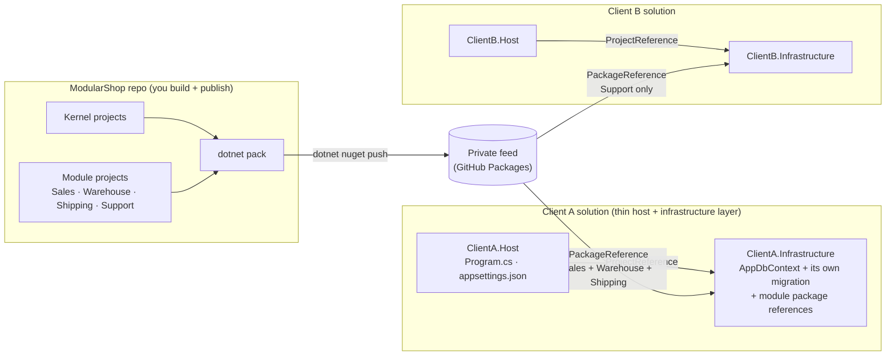

# Packaging & Distribution — turning the modules into NuGet packages a client can reuse

This is a **step-by-step guide** for someone who has **never published a NuGet package before**. By the end
you will:

1. Turn ModularShop's kernel + modules into **versioned NuGet packages**.
2. Publish them to a **private feed** (we use **GitHub Packages** — free, no server to run).
3. Build a brand-new **client "micro-solution"** that installs those packages, picks the modules it wants,
   and runs — **without ever referencing ModularShop's source code**.

> **Read the architecture first.** This guide assumes you understand [`architecture.md`](./architecture.md):
> each module owns an ordinary `DbContext`; one host context composes them by reflection; the kernel is
> itself a module; modules are discovered by scanning assemblies and selected by an `appsettings.json`
> `"Modules"` array. Packaging changes **none** of that — it only changes *how the module DLLs arrive in a
> host's `bin` folder* (via a package instead of a project reference). The real, runnable output of this
> guide already lives in the sibling **`OrderingHub`** solution; §7 points at it.

---

## Table of contents

- [0. The big picture](#0-the-big-picture)
- [1. What becomes a package (and what does not)](#1-what-becomes-a-package-and-what-does-not)
- [2. The packaging rule: implementation packages + dependency-only meta-packages](#2-the-packaging-rule-implementation-packages--dependency-only-meta-packages)
- [3. One-time setup in the ModularShop solution](#3-one-time-setup-in-the-modularshop-solution)
- [4. Versioning, in simple terms](#4-versioning-in-simple-terms)
- [5. Part A — prove it locally first (a folder feed)](#5-part-a--prove-it-locally-first-a-folder-feed)
- [6. Part B — publish to a real private feed (GitHub Packages)](#6-part-b--publish-to-a-real-private-feed-github-packages)
- [7. Building a new client micro-solution (worked example)](#7-building-a-new-client-micro-solution-worked-example)
- [8. How the packages are invoked at runtime](#8-how-the-packages-are-invoked-at-runtime)
- [9. Updating a client to newer packages](#9-updating-a-client-to-newer-packages)
- [10. Troubleshooting & environment gotchas](#10-troubleshooting--environment-gotchas)
- [Appendix — command cheat-sheet](#appendix--command-cheat-sheet)

---

## 0. The big picture

Think of your reusable code as **products on a shelf**. You *pack* each product into a **box with a version
number** (a NuGet package) and put the boxes on a **shared shelf** (a private feed). Any new client project
"orders" the boxes it wants by name and version — it never needs the source.



A client solution is a **thin two-project shell that mirrors ModularShop's own layering**: a thin **`.Host`**
(`Program.cs` + `appsettings.json` — it wires HTTP only) sitting on top of an **`.Infrastructure`** layer
(the mirror of `ModularShop.Infrastructure`) that owns the ~10-line composing `DbContext`, this client's own
migration, and the module package references. The Infrastructure layer references **one public package per
module** (`ModularShop.Modules.Sales`, `ModularShop.Modules.Warehouse`, …); the Host references that project
plus the host-only concerns. Those public module packages are **dependency-only meta-packages** — tiny SDK
projects that ship no DLL of their own and exist only to declare which packages make up a module.

---

## 1. What becomes a package (and what does not)

| Group | Projects / files | Ships as a package? | Client references directly? | Why |
|---|---|---:|---:|---|
| **Kernel layer packages** | `Kernel.Domain`, `Kernel.Application`, `Kernel.Infrastructure`, `Kernel.Api` | ✅ Yes | No | The real kernel assemblies — ordinary implementation packages. |
| **Kernel hosting meta-package** | `ModularShop.Kernel.Hosting` | ✅ Yes | ✅ Yes | The clean public package a client host installs for `IModule`, `AddModules`, `InitializeModulesAsync`, model composition, API envelope/middleware, Identity/kernel hosting. Ships no DLL; just depends on the four kernel packages. |
| **Feature module layer packages** | `Modules.Sales.{Domain,Application,Infrastructure,Api}` (same for Warehouse/Shipping/Support) | ✅ Yes | No | The Clean Architecture projects, kept packable so the meta-packages can depend on them. |
| **Feature module meta-packages** | `ModularShop.Modules.{Sales,Warehouse,Shipping,Support}` | ✅ Yes | ✅ Yes | The reusable business capabilities a client picks from: one package per module. Ship no DLL, so nothing extra reaches the runtime scan. |
| **Contracts packages** | `Modules.Sales.Contracts`, `Modules.Warehouse.Contracts` | ✅ Yes | Only when a caller needs the public contract directly | The only compile-time public surface between modules. Shipping/Support have none. |
| **The demo host** | `ModularShop.Server` | ❌ No (`IsPackable=false`) | No | This *is* the ModularShop app. Each client writes **its own** host. |
| **The demo's persistence** | `ModularShop.Infrastructure` (`ModularShopDbContext` + migrations) | ❌ No (`IsPackable=false`) | No | The composing context is generic (client copies ~10 lines); the **migrations are specific to the module set**, so each client owns its own — in its own `.Infrastructure` project (§7). |
| **The React SPA** | `client/` | ❌ No | No | Not a .NET project; ship per client as needed. |

So you publish **two kinds of packages**:

1. **Implementation packages** — the real assemblies from the existing layer projects (`.Domain`,
   `.Application`, `.Infrastructure`, `.Api`, `.Contracts`). Useful dependencies inside the graph; clients
   don't normally reference them directly.
2. **Public meta-packages** (`ModularShop.Kernel.Hosting`, `ModularShop.Modules.*`) — dependency-only SDK
   projects (`IncludeBuildOutput=false`) that depend on the right implementation packages and give consumers
   a clean install surface. They ship no assembly, so they add no packaging-only DLL to the runtime scan.

A client chooses **modules**, not Clean Architecture layers; the feed still contains the underlying packages
NuGet needs to restore the graph. That's fine — the **documented install surface** stays small and
business-oriented while the dependency graph remains visible to NuGet.

---

## 2. The packaging rule: implementation packages + dependency-only meta-packages

> Keep **one project = one package** for the existing implementation projects, then add **one dependency-only
> meta-package *project* per module** (plus one for kernel hosting) for clients to reference.

A meta-package is an ordinary SDK-style `.csproj` whose only job is to declare dependencies. Setting
`<IncludeBuildOutput>false</IncludeBuildOutput>` means it **ships no DLL** — the package is nothing but a list
of the packages that make up the module. That buys three things at once:

- a clean install surface (`install Sales`, not `install Sales.Infrastructure`);
- a clean runtime scan (no packaging-only `ModularShop.*.dll` reaches a client's `bin`, so
  `ModuleRegistration` only ever sees real module assemblies);
- **one toolchain and one version** — `dotnet pack ModularShop.slnx` builds these projects with everything
  else, project references become package dependencies automatically, and the single `<Version>` in
  `Directory.Build.props` (§3.1) is the only place a version lives.

Why not let clients reference `.Infrastructure` directly? Because it's an implementation layer. It happens to
contain the module registration class today, but the client shouldn't need to know that: it should say
"install Sales", not "install Sales.Infrastructure".

Each meta-package references **only its own module** (the kernel hosting package plus its own
`.Infrastructure`), **never another module's meta-package**. Everything else arrives transitively, exactly
as inside the solution:

```
ClientA.Infrastructure  ──references──►  ModularShop.Modules.Sales   (meta-package; ships no DLL)
                                   ├─► ModularShop.Kernel.Hosting            (meta-package; ships no DLL)
                                   │       ├─► ModularShop.Kernel.Domain
                                   │       ├─► ModularShop.Kernel.Application
                                   │       ├─► ModularShop.Kernel.Infrastructure
                                   │       └─► ModularShop.Kernel.Api
                                   └─► ModularShop.Modules.Sales.Infrastructure
                                           ├─► ModularShop.Modules.Sales.Application
                                           │       ├─► ModularShop.Modules.Sales.Contracts       (OrderPlaced)
                                           │       └─► ModularShop.Modules.Warehouse.Contracts    ← compile-time contract only
                                           ├─► ModularShop.Modules.Sales.Domain
                                           └─► ModularShop.Modules.Sales.Api        (controllers)
```

Sales' meta-package has just **two** project references. Sales *needs* Warehouse at runtime (it calls
`IWarehouseApi` synchronously), but **that requirement is deliberately not in the package graph** — it lives
in `SalesModule.RequiredModules => ["Warehouse"]`, validated at startup (§3.4). This is the one idea to
internalise, because it keeps two kinds of dependency in their proper places:

| Dependency kind | Where it belongs | Example |
|---|---|---|
| **Compile-time inter-module dependency** | A project reference between the real implementation projects | `Sales.Application` references `Warehouse.Contracts` only. |
| **Runtime capability dependency** | `IModule.RequiredModules`, validated at startup; the client installs the required module's package itself | `SalesModule.RequiredModules => ["Warehouse"]`; ClientA references `ModularShop.Modules.Warehouse`. |

The `Contracts` isolation survives packaging: `Sales.Application` references only `Warehouse.Contracts`, so
Sales still cannot name `Product` or `WarehouseDbContext`.

### 2.1 Create the meta-package projects

Each meta-package is a tiny SDK project built on three ideas:

- `<IncludeBuildOutput>false</IncludeBuildOutput>` — pack **no** assembly; dependencies only.
- **`ProjectReference`s to the real projects** — at pack time each project reference becomes a package
  dependency at the shared `<Version>`. You never hand-write a dependency list or a version number. Because a
  reference to a *packable* project becomes a *dependency* (not an inlined DLL), a module meta-package need
  only reference its own `.Infrastructure`; the rest comes transitively.
- `<NoWarn>$(NoWarn);NU5128</NoWarn>` — silences the expected "package has dependencies but no library" warning.

Create one project per module plus one kernel hosting project, and add them to the solution:

```bash
dotnet new classlib -n ModularShop.Kernel.Hosting   -o src/Kernel/ModularShop.Kernel.Hosting
dotnet new classlib -n ModularShop.Modules.Sales     -o src/Modules/Sales/ModularShop.Modules.Sales
dotnet new classlib -n ModularShop.Modules.Warehouse -o src/Modules/Warehouse/ModularShop.Modules.Warehouse
dotnet new classlib -n ModularShop.Modules.Shipping  -o src/Modules/Shipping/ModularShop.Modules.Shipping
dotnet new classlib -n ModularShop.Modules.Support   -o src/Modules/Support/ModularShop.Modules.Support

dotnet sln ModularShop.slnx add \
  src/Kernel/ModularShop.Kernel.Hosting/ModularShop.Kernel.Hosting.csproj \
  src/Modules/Sales/ModularShop.Modules.Sales/ModularShop.Modules.Sales.csproj \
  src/Modules/Warehouse/ModularShop.Modules.Warehouse/ModularShop.Modules.Warehouse.csproj \
  src/Modules/Shipping/ModularShop.Modules.Shipping/ModularShop.Modules.Shipping.csproj \
  src/Modules/Support/ModularShop.Modules.Support/ModularShop.Modules.Support.csproj
```

> **Delete the generated `Class1.cs` from each project** — a meta-package carries no code. (Even if you
> forget, `IncludeBuildOutput=false` keeps the DLL out of the package, so it never reaches a client's `bin`.)

### 2.2 The kernel hosting meta-package

`ModularShop.Kernel.Hosting` represents the complete kernel hosting surface a client host needs — including
`Kernel.Api` (the `AuthController` and exception middleware the host wires by name), which no module's
`.Infrastructure` pulls in. It is the one meta-package that references **all four** kernel projects:

**`src/Kernel/ModularShop.Kernel.Hosting/ModularShop.Kernel.Hosting.csproj`**
```xml
<Project Sdk="Microsoft.NET.Sdk">

  <PropertyGroup>
    <TargetFramework>net10.0</TargetFramework>
    <IncludeBuildOutput>false</IncludeBuildOutput>   <!-- meta-package: ship no DLL -->
    <NoWarn>$(NoWarn);NU5128</NoWarn>                 <!-- "dependencies but no library" is expected here -->
    <PackageId>ModularShop.Kernel.Hosting</PackageId>
    <Description>Hosting and module-composition package for ModularShop client hosts.</Description>
  </PropertyGroup>

  <ItemGroup>
    <ProjectReference Include="..\ModularShop.Kernel.Domain\ModularShop.Kernel.Domain.csproj" />
    <ProjectReference Include="..\ModularShop.Kernel.Application\ModularShop.Kernel.Application.csproj" />
    <ProjectReference Include="..\ModularShop.Kernel.Infrastructure\ModularShop.Kernel.Infrastructure.csproj" />
    <ProjectReference Include="..\ModularShop.Kernel.Api\ModularShop.Kernel.Api.csproj" />
  </ItemGroup>

</Project>
```

The client still writes the same usings (`ModularShop.Kernel.Api`, `.Infrastructure`,
`.Infrastructure.Persistence`); only the package name it installs is cleaner.

### 2.3 The four module meta-packages

Every module meta-package is **identical except for three things**: its `PackageId`/`Description` and the one
`.Infrastructure` `ProjectReference` it carries. Here is the template (Sales shown); the others differ only in
the highlighted values:

**`src/Modules/Sales/ModularShop.Modules.Sales/ModularShop.Modules.Sales.csproj`**
```xml
<Project Sdk="Microsoft.NET.Sdk">

  <PropertyGroup>
    <TargetFramework>net10.0</TargetFramework>
    <IncludeBuildOutput>false</IncludeBuildOutput>
    <NoWarn>$(NoWarn);NU5128</NoWarn>
    <PackageId>ModularShop.Modules.Sales</PackageId>                       <!-- ← per module -->
    <Description>Sales module package for ModularShop client hosts.</Description>
  </PropertyGroup>

  <ItemGroup>
    <ProjectReference Include="..\..\..\Kernel\ModularShop.Kernel.Hosting\ModularShop.Kernel.Hosting.csproj" />
    <!-- The module's own .Infrastructure — brings its Application/Domain/Api/Contracts transitively. -->
    <ProjectReference Include="..\ModularShop.Modules.Sales.Infrastructure\ModularShop.Modules.Sales.Infrastructure.csproj" />
  </ItemGroup>

</Project>
```

| Meta-package | Own `.Infrastructure` reference | What it carries transitively | Runtime note |
|---|---|---|---|
| `ModularShop.Modules.Sales` | `Sales.Infrastructure` | `Sales.Application` (→ `Sales.Contracts`, `Warehouse.Contracts`), `Sales.Domain`, `Sales.Api` | **Requires Warehouse** at runtime (`IWarehouseApi`) — declared in `SalesModule.RequiredModules`, *not* referenced here. |
| `ModularShop.Modules.Warehouse` | `Warehouse.Infrastructure` | `Warehouse.{Application,Domain,Api,Contracts}` and — for the `OrderPlaced` handler — `Sales.Contracts` | No required modules: exposes products/stock without Sales; merely *reacts* to `OrderPlaced`. |
| `ModularShop.Modules.Shipping` | `Shipping.Infrastructure` | `Shipping.{Application,Domain,Api}` and `Sales.Contracts` (for the event type) | No required modules: only *reacts* to `OrderPlaced`; runs fine without Sales. |
| `ModularShop.Modules.Support` | `Support.Infrastructure` | `Support.{Application,Domain,Api}` | No contracts package, no required modules — fully independent. |

That's why **no module meta-package ever references another module's meta-package**: cross-module *runtime*
needs live in `RequiredModules` (§3.4), and cross-module *compile-time* needs are already satisfied by the
`.Contracts` package a module's `.Application`/`.Infrastructure` pulls in.

### 2.4 The contracts rule

Keep contracts separate; never let a meta-package be the only copy of a contract.

| Case | What to depend on |
|---|---|
| A module compiles against another module's public surface | The other module's `*.Contracts` package only (e.g. `Sales.Application` → `Warehouse.Contracts`). |
| A meta-package represents everything needed to install that module | Its own `.Infrastructure` (which carries its `*.Contracts` transitively). |
| A module cannot run without another being present | Declare it in `IModule.RequiredModules` (host-validated at startup); the client installs that module's meta-package. **Never** reference another module's meta-package. |
| A module only *reacts* to another module's event and is useful without it | The event publisher's `*.Contracts` package only (no `RequiredModules` entry) — e.g. `Warehouse.Infrastructure` → `Sales.Contracts`. |

The implementation/layer packages stay **packable** (the meta-packages depend on them) but
**private-by-convention**: the feed contains more packages than a client references, and that's fine — only
the meta-packages and the occasional `*.Contracts` are the documented public surface.

---

## 3. One-time setup in the ModularShop solution

You need to (a) give every package a name, version, and author, (b) mark the two host projects as
"don't pack me," (c) add the meta-package projects (§2), and (d) add startup validation so clients get a
clear error when they select an incomplete module set. Central Package Management (`Directory.Packages.props`)
is **already** enabled in this repo, so third-party versions are handled.

### 3.1 Add a `Directory.Build.props` at the repo root

Create **`/ModularShop/Directory.Build.props`** (next to `Directory.Packages.props`). MSBuild applies it to
**every** project automatically, so all packages share one set of metadata and one version:

```xml
<Project>
  <PropertyGroup>
    <!-- One version for the whole suite. Bump this one line to release everything together (see §4). -->
    <Version>1.0.0</Version>

    <!-- Package metadata (shown on the feed). -->
    <Authors>TNEX</Authors>
    <Company>TNEX</Company>
    <Product>ModularShop Modules</Product>
    <PackageLicenseExpression>MIT</PackageLicenseExpression>

    <!-- Needed by GitHub Packages to attach packages to the right repo; also enables SourceLink. -->
    <RepositoryUrl>https://github.com/YOUR-ORG/ModularShop</RepositoryUrl>
    <RepositoryType>git</RepositoryType>

    <!-- Generate XML documentation for IntelliSense. -->
    <GenerateDocumentationFile>true</GenerateDocumentationFile>
    <NoWarn>$(NoWarn);CS1591</NoWarn>   <!-- don't warn about missing XML comments while docs are added -->

    <!-- Step-debug into the packages from ANY feed: embed the PDB into each DLL (no separate .snupkg, which
         GitHub Packages could not serve anyway), plus SourceLink metadata so a debugger can fetch the source. -->
    <DebugType>embedded</DebugType>
    <PublishRepositoryUrl>true</PublishRepositoryUrl>
    <EmbedUntrackedSources>true</EmbedUntrackedSources>

    <!-- Deterministic, path-normalised builds — but ONLY in CI (on a dev machine it degrades local debugging). -->
    <ContinuousIntegrationBuild Condition="'$(GITHUB_ACTIONS)' == 'true' or '$(TF_BUILD)' == 'true'">true</ContinuousIntegrationBuild>
  </PropertyGroup>
</Project>
```

> Replace `YOUR-ORG` with your GitHub organisation or username. Change `TNEX`/license to taste.

### 3.2 Mark the two host projects as non-packable

The demo host and its migrations must **not** be published. Add one line to each `<PropertyGroup>`:

```xml
<!-- src/ModularShop.Server/ModularShop.Server.csproj -->
<IsPackable>false</IsPackable>   <!-- the demo web host is never a package -->
```
```xml
<!-- src/ModularShop.Infrastructure/ModularShop.Infrastructure.csproj -->
<IsPackable>false</IsPackable>   <!-- demo migrations are host-specific; each client owns its own -->
```

Every other implementation project stays packable by default, and so do the five meta-package projects — but
because they set `IncludeBuildOutput=false`, their packages contain no assembly. Because the real module
assemblies keep the `ModularShop.*` name, the runtime scan (`ModuleRegistration.cs`,
`Directory.EnumerateFiles(..., "ModularShop.*.dll")`) finds them in a client's `bin` exactly as today, while
the meta-packages contribute no DLL and therefore no extra `IModule` type. *(If you later rebrand to, say,
`TNEX.*`, rename the projects **and** change that one scan pattern.)*

### 3.3 One command packs everything

Because the meta-package projects are part of the solution, **one `dotnet pack ModularShop.slnx` produces the
implementation packages *and* the meta-packages** — no second tool, no separate script. A folder feed then
contains files like:

```
ModularShop.Kernel.Domain.1.0.0.nupkg
ModularShop.Kernel.Application.1.0.0.nupkg
ModularShop.Kernel.Infrastructure.1.0.0.nupkg
ModularShop.Kernel.Api.1.0.0.nupkg
ModularShop.Kernel.Hosting.1.0.0.nupkg              ← meta-package (no DLL inside)

ModularShop.Modules.Sales.Domain.1.0.0.nupkg
ModularShop.Modules.Sales.Application.1.0.0.nupkg
ModularShop.Modules.Sales.Contracts.1.0.0.nupkg
ModularShop.Modules.Sales.Infrastructure.1.0.0.nupkg
ModularShop.Modules.Sales.Api.1.0.0.nupkg
ModularShop.Modules.Sales.1.0.0.nupkg               ← meta-package (no DLL inside)

ModularShop.Modules.Warehouse.Contracts.1.0.0.nupkg
ModularShop.Modules.Warehouse.1.0.0.nupkg           ← meta-package
ModularShop.Modules.Shipping.1.0.0.nupkg            ← meta-package
ModularShop.Modules.Support.1.0.0.nupkg             ← meta-package
... implementation packages for Warehouse, Shipping and Support ...
```

The meta-packages are the packages clients install; the implementation packages are still published because
NuGet needs them as the meta-packages' dependencies. (The two `IsPackable=false` host projects are absent.)

> **Sanity check:** a `.nupkg` is a zip — open `ModularShop.Modules.Sales.1.0.0.nupkg` and you should find a
> `.nuspec` with a `<dependencies>` list and **no `lib/` folder**. That empty `lib/` is
> `IncludeBuildOutput=false` working: the meta-package ships dependencies only, never an assembly.

### 3.4 Add startup validation for required modules

Once clients can choose any module combination, the host should fail fast when the selected set is
incomplete — e.g. `Sales` enabled without `Warehouse`, even though Sales calls `IWarehouseApi` synchronously.
This is the `RequiredModules` metadata from §2, and **it already exists in the kernel** (`IModule` +
`ModuleRegistration.AddModules`; only `SalesModule` declares a requirement today — `["Warehouse"]`). It is
described in full in **[decision-log D18](./decision-log.md)** and [architecture.md §5](./architecture.md);
the essentials for packaging:

- `IModule` exposes `IReadOnlyCollection<string> RequiredModules => Array.Empty<string>()`. A module that
  can't run alone overrides it (`SalesModule.RequiredModules => ["Warehouse"]`); Warehouse/Shipping/Support
  leave the default because they either only *react* to events or are independent.
- `ModuleRegistration.AddModules` runs `ValidateRequiredModules` **after** selection and **before** any
  registration or migration, throwing a single aggregated `InvalidOperationException` when the set is
  incomplete.

So a bad configuration fails at startup with a clear message instead of a DI resolution error on the first
order:

```json
"Modules": [ "Sales" ]
```
```
Invalid module selection:
Module 'Sales' requires module 'Warehouse', but 'Warehouse' is not enabled.
```

This validation lives in the **kernel** so it protects every host identically — the demo, every client
micro-solution, and every future package-based deployment — independent of how the DLLs arrive (project
reference or NuGet package). That is why the requirement lives here and **not** in the package graph.

---

## 4. Versioning, in simple terms

Every package carries a version like **`1.4.2`** = **major . minor . patch** (Semantic Versioning):

| Change | Bump | Meaning for a client |
|---|---|---|
| Bug fix, no API change | **patch** `1.4.2 → 1.4.3` | Always safe to take. |
| New feature, old stuff still works | **minor** `1.4.x → 1.5.0` | Safe. |
| Something changed that could break callers | **major** `1.x → 2.0.0` | Upgrade **on purpose**, when ready. |

**Start with one version for the whole suite** (the single `<Version>` in `Directory.Build.props`). It is the
simplest thing that works: bump one line, republish, done.

Two packages deserve extra care when you *do* make breaking changes:

- **`Kernel.*`** — everything depends on it, so a major kernel bump ripples to every module. Change rarely.
- **`*.Contracts`** — the promises *between* modules. Changing `IWarehouseApi` forces Warehouse and every
  caller to move together. Keep them small and stable.

> **Later (optional): version a single module on its own** by putting a `<Version>2.0.0</Version>` in *its*
> `.csproj` (it overrides the root value). Only do this once you actually need independent release cadences.

---

## 5. Part A — prove it locally first (a folder feed)

**Before touching any server**, verify the whole pack → install → run loop on your own machine using a
**local folder as a feed** — a directory full of `.nupkg` files, zero accounts, zero auth. If this works, the
only thing left for the "real" feed is authentication.

### 5.1 Create the feed folder and pack into it

```bash
# From the ModularShop repo root. Use a Windows-style path because dotnet here is the Windows SDK (§10).
# This makes ONE folder that holds every .nupkg — implementation and meta-packages together.
dotnet pack ModularShop.slnx -c Release -o "D:/TNEX/LocalFeed"
```

`dotnet pack` drops one `.nupkg` per **packable** project into `D:/TNEX/LocalFeed` (no separate `.snupkg` —
symbols are embedded, §3.1), producing exactly the files listed in §3.3. The two host projects are absent —
that's `IsPackable=false` working.

### 5.2 Register the folder as a NuGet source

Do this per-client via a `nuget.config` (§7.2) or, just for testing, globally:

```bash
dotnet nuget add source "D:/TNEX/LocalFeed" --name local-modularshop
dotnet nuget list source        # confirm it appears
```

You can now `dotnet add package ModularShop.Modules.Sales` from any project on this machine. **Jump to §7**
to build a client against it; once it runs locally, come back and do Part B to publish to the shared feed.

---

## 6. Part B — publish to a real private feed (GitHub Packages)

**Why GitHub Packages?** It is **free**, there is **no server to install or maintain**, it lives next to your
code, and it authenticates with a normal GitHub token. (Alternatives: **Azure Artifacts** — also free, best
if you already use Azure DevOps; or **BaGetter** — free but *you* host the server. GitHub Packages is the
least work to start.)

### 6.1 Create a Personal Access Token (PAT)

GitHub Packages authenticates with a **classic** PAT (not the fine-grained kind, for NuGet):

1. GitHub → avatar → **Settings** → **Developer settings** → **Personal access tokens** → **Tokens
   (classic)** → **Generate new token (classic)**.
2. Scopes: tick **`write:packages`** (includes `read:packages`) and **`repo`** if the repo is private.
3. Copy the token (`ghp_…`) and store it in an environment variable so it never lands in a file:

```bash
export GITHUB_TOKEN=ghp_xxxxxxxxxxxxxxxxxxxx     # add to ~/.bashrc for convenience
```

### 6.2 Push the packages

The feed URL is `https://nuget.pkg.github.com/OWNER/index.json`, where `OWNER` is your org or username.

```bash
# Push every package Part A produced. --skip-duplicate lets you re-run without errors.
dotnet nuget push "D:/TNEX/LocalFeed/*.nupkg" \
  --source "https://nuget.pkg.github.com/YOUR-ORG/index.json" \
  --api-key "$GITHUB_TOKEN" \
  --skip-duplicate
```

That uploads the implementation, contract, and public meta-packages. Refresh your GitHub **Packages** tab and
they'll be listed. Publishing a new version later is the same command after bumping `<Version>` and re-packing.

### 6.3 (Optional) automate it with GitHub Actions

Let CI pack/push whenever you push a version tag like `v1.0.0`. Create
**`.github/workflows/publish-packages.yml`**:

```yaml
name: Publish packages
on:
  push:
    tags: [ "v*" ]          # trigger on tags like v1.0.0

jobs:
  publish:
    runs-on: ubuntu-latest
    permissions:
      contents: read
      packages: write        # lets the built-in GITHUB_TOKEN push packages
    steps:
      - uses: actions/checkout@v4
      - uses: actions/setup-dotnet@v4
        with:
          dotnet-version: '10.0.x'
      - run: dotnet pack ModularShop.slnx -c Release -o ./artifacts -p:Version=${GITHUB_REF_NAME#v}
      - run: >
          dotnet nuget push "./artifacts/*.nupkg"
          --source "https://nuget.pkg.github.com/${{ github.repository_owner }}/index.json"
          --api-key "${{ secrets.GITHUB_TOKEN }}"
          --skip-duplicate
```

Now `git tag v1.0.0 && git push origin v1.0.0` publishes everything. (`secrets.GITHUB_TOKEN` is provided by
Actions automatically — no PAT needed inside CI.)

---

## 7. Building a new client micro-solution (worked example)

> **The complete, runnable version of this section already exists** as the sibling **`OrderingHub`** solution
> (built entirely from these packages: Sales + Warehouse, no Shipping/Support). Read this section for the
> *shape and rationale*, then look at `OrderingHub/` for a real copy of every file below.

A micro-solution is a **two-project solution that mirrors ModularShop's own layering** — not a single Host
project:

- a **`ClientA.Infrastructure`** class library (the mirror of `ModularShop.Infrastructure`) that owns the
  composing `AppDbContext` and this client's own EF Core migrations, and installs **one module meta-package
  per capability** it composes. It is the one place that knows the concrete module set.
- a thin **`ClientA.Host`** web project that references the Infrastructure project and adds only the host-only
  concerns (the SQL provider, EF tooling, Swagger). It wires HTTP; it holds no persistence code.

Keeping the `DbContext` and migrations in a dedicated Infrastructure layer keeps the host thin and matches
ModularShop exactly, so a client is structurally identical to the demo — just with a different module subset.

### 7.1 Folder layout

```
ClientA/
├─ ClientA.slnx                      # the solution (both projects)
├─ nuget.config                      # where to find the packages + how to authenticate
├─ Directory.Packages.props          # which versions (Central Package Management)
├─ ClientA.Infrastructure/           # composition/persistence layer — mirrors ModularShop.Infrastructure
│  ├─ ClientA.Infrastructure.csproj  #   installs one module meta-package per capability (+ Kernel.Hosting)
│  ├─ Persistence/AppDbContext.cs    #   the ~10-line composing context
│  └─ Migrations/                    #   THIS client's own migration (generated in 7.5)
└─ ClientA.Host/
   ├─ ClientA.Host.csproj            # references the Infrastructure project + host-only concerns
   ├─ Program.cs                     # the composition root (copied from ModularShop.Server)
   ├─ appsettings.json               # connection string + "Modules" selection
   ├─ appsettings.Development.json    # dev logging
   └─ Properties/launchSettings.json # launches the browser at /swagger, like ModularShop.Server
```

### 7.2 `nuget.config` — point at the feed

Put this at the **ClientA root**. Relative paths resolve relative to the file, which sidesteps WSL path issues.

```xml
<?xml version="1.0" encoding="utf-8"?>
<configuration>
  <packageSources>
    <clear />
    <add key="nuget.org" value="https://api.nuget.org/v3/index.json" />
    <!-- While testing locally (Part A). Relative to THIS file; assumes ClientA/ sits next to LocalFeed/
         (both under D:/TNEX). Delete this line once you use the real feed. -->
    <add key="local-modularshop" value="../LocalFeed" />
    <!-- The private feed (Part B). -->
    <add key="github" value="https://nuget.pkg.github.com/YOUR-ORG/index.json" />
  </packageSources>

  <packageSourceCredentials>
    <github>
      <add key="Username" value="YOUR-GITHUB-USERNAME" />
      <add key="ClearTextPassword" value="%GITHUB_TOKEN%" />   <!-- reads the token from the env -->
    </github>
  </packageSourceCredentials>
</configuration>
```

### 7.3 `Directory.Packages.props` — pin the versions

Central Package Management on the client side too, so versions live in one file:

```xml
<Project>
  <PropertyGroup>
    <ManagePackageVersionsCentrally>true</ManagePackageVersionsCentrally>
  </PropertyGroup>
  <ItemGroup>
    <!-- The framework / host composition package -->
    <PackageVersion Include="ModularShop.Kernel.Hosting" Version="1.0.0" />
    <!-- The modules this client wants (one public package per module) -->
    <PackageVersion Include="ModularShop.Modules.Sales" Version="1.0.0" />
    <PackageVersion Include="ModularShop.Modules.Warehouse" Version="1.0.0" />
    <PackageVersion Include="ModularShop.Modules.Shipping" Version="1.0.0" />
    <!-- Host tooling -->
    <PackageVersion Include="Microsoft.EntityFrameworkCore.SqlServer" Version="10.0.9" />
    <PackageVersion Include="Microsoft.EntityFrameworkCore.Design" Version="10.0.9" />
    <PackageVersion Include="Swashbuckle.AspNetCore" Version="10.2.3" />
  </ItemGroup>
</Project>
```

> You only list packages you reference **directly**. Transitive ones (the `.Infrastructure`, `.Application`,
> `.Domain`, `.Contracts`, `.Api`, Identity, MediatR, Ardalis.Result … packages) resolve automatically.
> List each module you want, **including required ones**: ClientA installs `Warehouse` itself (Sales needs
> it — `SalesModule.RequiredModules` checks it's enabled at startup, §3.4).

### 7.4 The two `.csproj` files

Note there is **no** `<Version>` on each `PackageReference` — that's Central Package Management doing its job.

**`ClientA.Infrastructure.csproj`** — the persistence/composition layer, the mirror of
`ModularShop.Infrastructure`. It installs **one module meta-package per capability** plus the kernel hosting
package that `AppDbContext` compiles against; the modules' layer packages and EF Core (with the SqlServer
provider the migrations are written against) come along transitively.

```xml
<Project Sdk="Microsoft.NET.Sdk">
  <PropertyGroup>
    <TargetFramework>net10.0</TargetFramework>
    <Nullable>enable</Nullable>
    <ImplicitUsings>enable</ImplicitUsings>
    <RootNamespace>ClientA.Infrastructure</RootNamespace>
  </PropertyGroup>

  <ItemGroup>
    <PackageReference Include="ModularShop.Kernel.Hosting" />
    <!-- One public meta-package per module this client wants. -->
    <PackageReference Include="ModularShop.Modules.Sales" />
    <PackageReference Include="ModularShop.Modules.Warehouse" />
    <PackageReference Include="ModularShop.Modules.Shipping" />
  </ItemGroup>
</Project>
```

**`ClientA.Host.csproj`** — the thin web host. It references the Infrastructure project (which transitively
carries every module DLL into `bin` for the runtime scan) and adds only the host-only concerns. It keeps
`ModularShop.Kernel.Hosting` referenced by name because `Program.cs` uses it directly — exactly as
`ModularShop.Server` references `ModularShop.Kernel.Api` by name even though it also arrives transitively.
It turns off implicit controller discovery to match the demo host (routes come from each module registering
its own `.Api` application part, §8 / decision-log D13).

```xml
<Project Sdk="Microsoft.NET.Sdk.Web">
  <PropertyGroup>
    <TargetFramework>net10.0</TargetFramework>
    <Nullable>enable</Nullable>
    <ImplicitUsings>enable</ImplicitUsings>
    <GenerateMvcApplicationPartsAssemblyAttributes>false</GenerateMvcApplicationPartsAssemblyAttributes>
  </PropertyGroup>

  <ItemGroup>
    <ProjectReference Include="..\ClientA.Infrastructure\ClientA.Infrastructure.csproj" />
  </ItemGroup>

  <ItemGroup>
    <!-- Used by name in Program.cs; declared directly even though it also arrives transitively. -->
    <PackageReference Include="ModularShop.Kernel.Hosting" />
    <!-- Host concerns: the SQL provider (Program.cs calls UseSqlServer), EF migration tooling, Swagger. -->
    <PackageReference Include="Microsoft.EntityFrameworkCore.SqlServer" />
    <PackageReference Include="Microsoft.EntityFrameworkCore.Design">
      <PrivateAssets>all</PrivateAssets>
    </PackageReference>
    <PackageReference Include="Swashbuckle.AspNetCore" />
  </ItemGroup>
</Project>
```

The **`ClientA.slnx`** ties the two together:

```xml
<Solution>
  <Project Path="ClientA.Infrastructure/ClientA.Infrastructure.csproj" />
  <Project Path="ClientA.Host/ClientA.Host.csproj" />
</Solution>
```

### 7.5 The only code you write — `AppDbContext`, `Program.cs`, config

**`ClientA.Infrastructure/Persistence/AppDbContext.cs`** — a near-verbatim copy of ModularShop's generic host
context, living in this client's Infrastructure layer alongside the migrations it owns. It holds no entities;
it just asks the registered modules to compose their models:

```csharp
using Microsoft.EntityFrameworkCore;
using ModularShop.Kernel.Infrastructure;                 // IModule
using ModularShop.Kernel.Infrastructure.Persistence;     // ApplyModuleModels(...)

namespace ClientA.Infrastructure.Persistence;

public sealed class AppDbContext : DbContext
{
    private readonly IReadOnlyList<IModule> _modules;

    public AppDbContext(DbContextOptions<AppDbContext> options, IEnumerable<IModule> modules)
        : base(options) => _modules = modules.ToList();

    protected override void OnModelCreating(ModelBuilder modelBuilder)
        => this.ApplyModuleModels(modelBuilder, _modules);
}
```

**`ClientA.Host/Program.cs`** is `ModularShop.Server/Program.cs` copied verbatim with just **two changes**:
the context type becomes `AppDbContext`, and the connection-string key is renamed (e.g. `"AppDb"`). Everything
module-specific still comes from `AddModules` / `InitializeModulesAsync`, so nothing else changes. See
`OrderingHub.Host/Program.cs` for the exact file, or [architecture.md §5](./architecture.md) for the annotated
original.

**`ClientA.Host/appsettings.json`** — the connection string and the **module selection**. This is where a
client decides which capabilities it runs:

```json
{
  "ConnectionStrings": {
    "AppDb": "Server=localhost;Database=ClientA;Trusted_Connection=True;TrustServerCertificate=True;MultipleActiveResultSets=True"
  },
  "Modules": [ "Sales", "Warehouse", "Shipping" ],
  "Logging": { "LogLevel": { "Default": "Information", "Microsoft.AspNetCore": "Warning" } },
  "AllowedHosts": "*"
}
```

> `"Modules"` lists **feature** modules only; the foundational kernel always loads. Support is omitted here,
> so this client has no `support` schema and no ticket endpoints. Omit the `"Modules"` key entirely to load
> **every** module you referenced.

**`ClientA.Host/Properties/launchSettings.json`** — makes Swagger launch by default, like `ModularShop.Server`
(a Development environment with `launchUrl: "swagger"`), on ports that don't clash with the demo host:

```json
{
  "$schema": "https://json.schemastore.org/launchsettings.json",
  "profiles": {
    "http": {
      "commandName": "Project",
      "dotnetRunMessages": true,
      "launchBrowser": true,
      "launchUrl": "swagger",
      "applicationUrl": "http://localhost:5090",
      "environmentVariables": { "ASPNETCORE_ENVIRONMENT": "Development" }
    }
  }
}
```

### 7.6 Restore, generate this client's migration, and run

```bash
# 1. Restore from the feed (reads nuget.config; needs GITHUB_TOKEN set for the github source).
dotnet restore ClientA/ClientA.slnx

# 2. Generate THIS client's migration into the Infrastructure project (where AppDbContext lives), booting
#    the Host as the startup project. Because AppDbContext composes only the selected modules, the migration
#    covers exactly kernel + Sales + Warehouse + Shipping (no support schema).
dotnet ef migrations add InitialCreate \
  --project         ClientA/ClientA.Infrastructure \
  --startup-project ClientA/ClientA.Host \
  --context         AppDbContext

# 3. Run. On first start it creates the ClientA database, applies the migration, and seeds each module.
dotnet run --project ClientA/ClientA.Host
```

The default launch profile opens the browser at `/swagger`. Sign in with a seeded user (the kernel seeds
`admin@modularshop.local` / `Passw0rd!`), and you have a running app built **entirely from packages** — no
ModularShop source anywhere in the client.

> **Smoke-test the controllers.** Since routes come from each module's application part (not bin-scanning),
> hit one endpoint per module (`GET /api/products`, `/api/orders`, `/api/shipments`) and expect `200`/`401`,
> not `404`. A `404` on a selected module means its package isn't referenced or isn't in `"Modules"`.
>
> **Why the client generates its own migration:** the one host migration inside the ModularShop repo covers
> *all* modules. A client that composes a *subset* has a *different* model, so it owns its own migration
> chain. `dotnet ef` boots this host's own services, so `AddModules` selects the same set the runtime will —
> the migration matches the client exactly. (No design-time factory is needed.)

---

## 8. How the packages are invoked at runtime

Nothing here is new — it's the same mechanism as the monorepo (architecture.md §5), just fed by packages:

1. **Discovery.** `AddModules` → `DiscoverModules()` scans `AppContext.BaseDirectory` (the client's `bin`)
   for `ModularShop.*.dll` and loads every `IModule`. The packaged DLLs are in `bin`, so they're found
   exactly like project-referenced ones.
2. **Selection & validation.** The `"Modules"` array keeps the named modules (+ the always-on kernel), then
   `ValidateRequiredModules` (§3.4) fails fast if any selected module's `RequiredModules` are not all present.
3. **Registration.** Each module's `Register(...)` wires its own use cases, MediatR bus (if any), and seeder,
   and registers its `.Api` assembly as an MVC **application part**. Implicit discovery is off (D13), so
   routes appear only for selected, registered modules.
4. **Composition.** `AppDbContext.OnModelCreating` calls `ApplyModuleModels`, which reflects each module
   context's `OnModelCreating` onto the one shared model.
5. **Startup.** `InitializeModulesAsync` migrates the one database once, then runs each seeder in `Order`.

The order → shipment flow works because ClientA installed **both** Sales and Warehouse: Sales resolves
`IWarehouseApi` (implemented by the Warehouse package), and Shipping reacts to `OrderPlaced`. An incomplete
selection (`"Sales"` without `"Warehouse"`) is caught by step 2's validation, not by a DI failure on the
first order.

---

## 9. Updating a client to newer packages

1. Publish a new version from the ModularShop repo (bump `<Version>`, `dotnet pack`, push — or push a
   `v1.1.0` tag if CI is set up).
2. In the client, bump the numbers in its **`Directory.Packages.props`** (e.g. `1.0.0 → 1.1.0`) and
   `dotnet restore`. Each client moves **on its own schedule** — that's the whole benefit.
3. **If a module's database model changed** in that version, add a migration in the client and re-run:
   ```bash
   dotnet ef migrations add UpgradeToV1_1 --project ClientA/ClientA.Infrastructure --startup-project ClientA/ClientA.Host --context AppDbContext
   ```
   The client owns its database, so it owns the migration that moves it forward. (A patch/feature release
   with no schema change needs no migration.)

---

## 10. Troubleshooting & environment gotchas

**This machine's toolchain (WSL2 + Windows .NET/SQL):**
- `dotnet` here is the **Windows** SDK via a wrapper, so it does **not** understand `/mnt/...` paths. Pass
  **Windows-style** paths (`D:/TNEX/LocalFeed`) to `-o`, `--source`, etc., or use paths **relative** to a
  config file. A `/mnt/...` path silently creates junk under `D:\mnt\d\...`.
- SQL Server is the Windows install; `Server=localhost;Trusted_Connection=True;TrustServerCertificate=True`
  works from a Windows .NET process (shared memory). TCP is off, so a Linux-native process can't reach it.

**`401 Unauthorized` restoring/pushing to GitHub Packages** — `GITHUB_TOKEN` isn't set, the PAT lacks
`read:packages`/`write:packages`, or the `Username` in `nuget.config` is wrong. `echo $GITHUB_TOKEN` to
confirm it's exported.

**A module isn't loaded / its endpoints 404** — check the assembly name still starts with `ModularShop.`
(the scan pattern), that the module is named in `"Modules"` (or the key is absent), and that the client's
**`.Infrastructure`** project references the public module package so the implementation DLLs flow into `bin`.

**`Invalid module selection` at startup** — a selected module requires another that isn't enabled (e.g.
`Sales` requires `Warehouse`). Add the missing module package if needed, then add its name to `"Modules"`.

**`PendingModelChangesWarning` at startup** — the client's migration doesn't match its composed model. You
changed the `"Modules"` set (or a module version) without regenerating the migration. Add a fresh migration
(§9).

**"Package X was restored but the version is different"** — you referenced a version that isn't on the feed
yet. Confirm `dotnet pack` produced it and `dotnet nuget push` uploaded it, and that the version in the
client's `Directory.Packages.props` matches.

**CPM error: "PackageReference … must not specify a version"** — with Central Package Management, versions
live only in `Directory.Packages.props`; remove `Version="…"` from the `.csproj` `PackageReference`.

---

## Appendix — command cheat-sheet

```bash
# ── Publisher (ModularShop repo) ─────────────────────────────────────────────
# Pack everything — implementation + the five dependency-only meta-packages — in one command
# (skips the two IsPackable=false host projects):
dotnet pack ModularShop.slnx -c Release -o "D:/TNEX/LocalFeed"

# Local test feed:
dotnet nuget add source "D:/TNEX/LocalFeed" --name local-modularshop

# Publish to the private feed (GITHUB_TOKEN must be set):
dotnet nuget push "D:/TNEX/LocalFeed/*.nupkg" \
  --source "https://nuget.pkg.github.com/YOUR-ORG/index.json" \
  --api-key "$GITHUB_TOKEN" --skip-duplicate

# Release a new version: bump <Version> in Directory.Build.props, then re-pack + re-push
# (or: git tag v1.1.0 && git push origin v1.1.0  if CI is set up).

# ── Consumer (a client micro-solution: thin .Host over a .Infrastructure layer) ──
dotnet restore ClientA/ClientA.slnx
dotnet ef migrations add InitialCreate \
  --project ClientA/ClientA.Infrastructure --startup-project ClientA/ClientA.Host --context AppDbContext
dotnet run --project ClientA/ClientA.Host
```

---

### Summary

- **Implementation packages + dependency-only meta-packages.** A single `dotnet pack` produces the layer
  packages *and* the meta-packages (`IncludeBuildOutput=false`, so they ship no DLL); clients install one
  clean public package per module. Each meta-package references **only its own module** — never another
  module's meta-package. `Contracts` isolation is preserved.
- **Cross-module runtime needs live in `IModule.RequiredModules`, not the package graph** — the host
  validates the selection at startup and fails fast (decision-log D18). Controllers likewise come from each
  module registering its own `.Api` application part, with implicit discovery off (D13).
- **Publish to GitHub Packages** (free, no server); symbols are embedded so step-into works from any feed.
  Prove the loop with a **local folder feed** first.
- **A client is a thin two-project solution that mirrors ModularShop's layering** — a thin `.Host` over a
  `.Infrastructure` layer that owns the ~10-line `AppDbContext`, its **own migration**, and the module
  package references (`"Modules"` in `appsettings.json` selects which run). It never references ModularShop's
  source or its host — only `ModularShop.Kernel.Hosting` plus the public module packages it chose. The
  sibling **`OrderingHub`** solution is a real, runnable instance of this shape.
