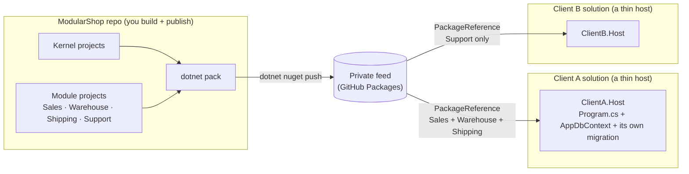

# Packaging & Distribution — turning the modules into NuGet packages a client can reuse

This is a **step-by-step guide** for someone who has **never published a NuGet package before**. By the end
you will:

1. Turn ModularShop's kernel + modules into **versioned NuGet packages**.
2. Publish them to a **private feed** (we use **GitHub Packages** — free, no server to run).
3. Build a brand-new **client "micro-solution"** that installs those packages, picks the modules it wants,
   and runs — **without ever referencing ModularShop's source code**.

> **Read the architecture first.** This guide assumes you understand [`architecture.md`](./architecture.md):
> each module owns an ordinary `DbContext`; one host context composes them by reflection; the kernel is
> itself a module; modules are discovered by scanning assemblies and selected by an `appsettings.json`
> `"Modules"` array. Packaging changes **none** of that — it only changes *how the module DLLs arrive in a
> host's `bin` folder* (via a package instead of a project reference).

---

## Table of contents

- [0. The big picture](#0-the-big-picture)
- [1. What becomes a package (and what does not)](#1-what-becomes-a-package-and-what-does-not)
- [2. The packaging rule: implementation packages + dependency-only meta-packages](#2-the-packaging-rule-implementation-packages--dependency-only-meta-packages)
- [3. One-time setup in the ModularShop solution](#3-one-time-setup-in-the-modularshop-solution)
- [4. Versioning, in simple terms](#4-versioning-in-simple-terms)
- [5. Part A — prove it locally first (a folder feed)](#5-part-a--prove-it-locally-first-a-folder-feed)
- [6. Part B — publish to a real private feed (GitHub Packages)](#6-part-b--publish-to-a-real-private-feed-github-packages)
- [7. Building a new client micro-solution (full worked example)](#7-building-a-new-client-micro-solution-full-worked-example)
- [8. How the packages are invoked and used at runtime](#8-how-the-packages-are-invoked-and-used-at-runtime)
- [9. Updating a client to newer packages](#9-updating-a-client-to-newer-packages)
- [10. Troubleshooting & environment gotchas](#10-troubleshooting--environment-gotchas)
- [Appendix — command cheat-sheet](#appendix--command-cheat-sheet)

---

## 0. The big picture

Think of your reusable code as **products on a shelf**. You *pack* each product into a **box with a version
number** (a NuGet package) and put the boxes on a **shared shelf** (a private feed). Any new client project
"orders" the boxes it wants by name and version — it never needs the source.



A client solution is basically an **empty shell**: a `Program.cs`, a tiny `DbContext`, an
`appsettings.json`, and a list of packages. The client references **one public package per module**
(`ModularShop.Modules.Sales`, `ModularShop.Modules.Warehouse`, …). Everything else lives behind those module packages and arrives through normal NuGet dependencies. In this version of the guide, those public module packages are **dependency-only meta-packages** — tiny SDK projects that ship no DLL of their own and exist only to declare which packages make up a module.

---

## 1. What becomes a package (and what does not)

| Group | Projects / files | Ships as packages? | Client references directly? | Why |
|---|---|---:|---:|---|
| **Kernel layer packages** | `Kernel.Domain`, `Kernel.Application`, `Kernel.Infrastructure`, `Kernel.Api` | ✅ Yes | Usually no | These are the real kernel assemblies. They stay as ordinary implementation packages. |
| **Kernel hosting meta-package** | `ModularShop.Kernel.Hosting` (dependency-only project) | ✅ Yes | ✅ Yes | This is the clean public package a client host installs for `IModule`, `AddModules`, `InitializeModulesAsync`, model composition helpers, API envelope/middleware, and Identity/kernel hosting support. It ships no DLL; it just depends on the kernel layer packages. |
| **Feature module layer packages** | `Modules.Sales.{Domain,Application,Infrastructure,Api}` and the same pattern for Warehouse/Shipping/Support | ✅ Yes | No | These keep the existing Clean Architecture projects packable and reusable. They are implementation details of the public module meta-packages. |
| **Feature module public meta-packages** | `ModularShop.Modules.Sales`, `Warehouse`, `Shipping`, `Support` (dependency-only projects) | ✅ Yes | ✅ Yes | These are the reusable business capabilities a client picks from: one package per module. They ship no DLL, so nothing extra reaches the runtime scan. |
| **Contracts packages** | `Modules.Sales.Contracts`, `Modules.Warehouse.Contracts` | ✅ Yes | Only when a caller/module needs the public contract directly | Contracts stay separate, tiny, and stable. They are still the only compile-time public surface between modules. Shipping/Support still have no `.Contracts` package unless another module must call them or subscribe to their public events. |
| **The demo host** | `ModularShop.Server` | ❌ No | No | This *is* the ModularShop application. Each client writes **its own** host. |
| **The demo's persistence** | `ModularShop.Infrastructure` (`ModularShopDbContext` + migrations) | ❌ No | No | The composing context is generic (client copies ~10 lines); the **migrations are specific to the module set**, so each client owns its own. |
| **The React SPA** | `client/` | ❌ No | No | Not a .NET project; ship per client as needed. |

So you publish two kinds of packages:

1. **Implementation packages** generated from the existing layer projects (`.Domain`, `.Application`,
   `.Infrastructure`, `.Api`, and `.Contracts`). These are real assemblies. They are useful dependencies
   inside the package graph, but clients should not normally reference them directly.
2. **Public meta-packages** (`ModularShop.Kernel.Hosting`, `ModularShop.Modules.Sales`,
   `ModularShop.Modules.Warehouse`, …). These are dependency-only SDK projects (`IncludeBuildOutput=false`)
   whose job is to depend on the right implementation packages and give consumers a clean install surface.
   They ship no assembly, so they add no packaging-only DLLs to the runtime scan, and `dotnet pack` builds
   them alongside everything else.

This keeps the client experience business-oriented while avoiding extra packaging-only C# projects:

a client chooses **modules**, not Clean Architecture layers; the feed still contains the underlying packages
NuGet needs to restore the dependency graph.

---

## 2. The packaging rule: implementation packages + dependency-only meta-packages

The practical rule is:

> Keep **one project = one package** for the existing implementation projects, then add **one dependency-only
> meta-package *project* per module** for clients to reference.

A meta-package here is an ordinary SDK-style `.csproj` whose only job is to declare dependencies. It sets
`<IncludeBuildOutput>false</IncludeBuildOutput>`, so it **ships no DLL of its own** — the package is nothing
but a list of the packages that make up the module. That buys three things at once:

- a clean install surface for clients (`install Sales`, not `install Sales.Infrastructure`);
- a clean runtime scan (no packaging-only `ModularShop.*.dll` ever reaches a client's `bin`, so
  `ModuleRegistration` only ever sees real module assemblies);
- **one toolchain and one version** — `dotnet pack ModularShop.slnx` builds these projects with everything
  else, project references become package dependencies automatically, and the single `<Version>` in
  `Directory.Build.props` is the only place a version lives.

Why not make clients reference `.Infrastructure` directly? Because `.Infrastructure` is an implementation
layer. It happens to contain the module registration class today, but the client should not need to know
that. The client should say, "install Sales", not "install Sales.Infrastructure".

The package graph should look like this — the Sales meta-package has just **three** project references, and
everything else arrives transitively (exactly as it already does inside the solution):

```
ClientA.Host  ──references──►  ModularShop.Modules.Sales        (meta-package; ships no DLL)
                                   │  (dotnet pack turns its project references into package deps;
                                   │   NuGet then restores the whole graph into the client's bin:)
                                   ├─► ModularShop.Kernel.Hosting            (meta-package; ships no DLL)
                                   │       ├─► ModularShop.Kernel.Domain
                                   │       ├─► ModularShop.Kernel.Application
                                   │       ├─► ModularShop.Kernel.Infrastructure
                                   │       └─► ModularShop.Kernel.Api
                                   ├─► ModularShop.Modules.Sales.Infrastructure
                                   │       ├─► ModularShop.Modules.Sales.Application
                                   │       │       ├─► ModularShop.Modules.Sales.Contracts       (OrderPlaced)
                                   │       │       └─► ModularShop.Modules.Warehouse.Contracts    ← compile-time contract only
                                   │       ├─► ModularShop.Modules.Sales.Domain
                                   │       └─► ModularShop.Modules.Sales.Api        (controllers)
                                   └─► ModularShop.Modules.Warehouse          (meta-package; ships no DLL) ← runtime module dependency
```

The important distinction is:

| Dependency kind | Where it belongs | Example |
|---|---|---|
| **Compile-time inter-module dependency** | Project references between the real implementation projects | `Sales.Application` references `Warehouse.Contracts` only. |
| **Runtime capability dependency** | A project reference from one meta-package to another, plus startup validation | `ModularShop.Modules.Sales` references `ModularShop.Modules.Warehouse` because Sales cannot run without Warehouse. |

The `Contracts` isolation is still preserved. `Sales.Application` references only `Warehouse.Contracts`, so
Sales still cannot name `Product` or `WarehouseDbContext`; the compile-time boundary survives packaging.
The Sales **meta-package** references the Warehouse **meta-package** to guarantee Warehouse's DLLs are present
at runtime, but that does **not** change the project-reference boundary between the implementation layers.

### 2.1 How a dependency-only meta-package works

Each meta-package is a tiny SDK project built on three ideas:

- `<IncludeBuildOutput>false</IncludeBuildOutput>` — pack **no** assembly; the package is dependencies only.
- **`ProjectReference`s to the real projects** — at pack time `dotnet pack` turns each project reference into
  a package dependency at the shared `<Version>`. You never hand-write a dependency list or a version number.
- `<NoWarn>$(NoWarn);NU5128</NoWarn>` — silences the "package has dependencies but no library" pack warning,
  which is expected and correct for a dependency-only package.

Because a `ProjectReference` to a *packable* project becomes a *dependency* (not an inlined DLL), you only
need to reference the module's `.Infrastructure` project: its `Application`, `Domain`, `Api`, and `Contracts`
packages come along transitively, just as they do inside the solution today. Create one project per module
plus one kernel hosting project:

```bash
dotnet new classlib -n ModularShop.Kernel.Hosting   -o src/Kernel/ModularShop.Kernel.Hosting
dotnet new classlib -n ModularShop.Modules.Sales     -o src/Modules/Sales/ModularShop.Modules.Sales
dotnet new classlib -n ModularShop.Modules.Warehouse -o src/Modules/Warehouse/ModularShop.Modules.Warehouse
dotnet new classlib -n ModularShop.Modules.Shipping  -o src/Modules/Shipping/ModularShop.Modules.Shipping
dotnet new classlib -n ModularShop.Modules.Support   -o src/Modules/Support/ModularShop.Modules.Support

dotnet sln ModularShop.slnx add \
  src/Kernel/ModularShop.Kernel.Hosting/ModularShop.Kernel.Hosting.csproj \
  src/Modules/Sales/ModularShop.Modules.Sales/ModularShop.Modules.Sales.csproj \
  src/Modules/Warehouse/ModularShop.Modules.Warehouse/ModularShop.Modules.Warehouse.csproj \
  src/Modules/Shipping/ModularShop.Modules.Shipping/ModularShop.Modules.Shipping.csproj \
  src/Modules/Support/ModularShop.Modules.Support/ModularShop.Modules.Support.csproj
```

> **Delete the generated `Class1.cs` from each of the five projects** — a meta-package carries no code. (Even
> if you forget, `IncludeBuildOutput=false` keeps the compiled DLL out of the package, so it never reaches a
> client's `bin`; an empty project is just clearer.)

### 2.2 Kernel hosting meta-package

`ModularShop.Kernel.Hosting` represents the complete kernel hosting surface a client host needs — including
`Kernel.Api` (the `AuthController` and exception middleware the host wires by name), which no module's
`.Infrastructure` pulls in. Reference all four kernel projects:

**`src/Kernel/ModularShop.Kernel.Hosting/ModularShop.Kernel.Hosting.csproj`**
```xml
<Project Sdk="Microsoft.NET.Sdk">

  <PropertyGroup>
    <TargetFramework>net10.0</TargetFramework>
    <IncludeBuildOutput>false</IncludeBuildOutput>   <!-- meta-package: ship no DLL -->
    <NoWarn>$(NoWarn);NU5128</NoWarn>                 <!-- "dependencies but no library" is expected here -->
    <PackageId>ModularShop.Kernel.Hosting</PackageId>
    <Description>Hosting and module-composition package for ModularShop client hosts.</Description>
  </PropertyGroup>

  <ItemGroup>
    <ProjectReference Include="..\ModularShop.Kernel.Domain\ModularShop.Kernel.Domain.csproj" />
    <ProjectReference Include="..\ModularShop.Kernel.Application\ModularShop.Kernel.Application.csproj" />
    <ProjectReference Include="..\ModularShop.Kernel.Infrastructure\ModularShop.Kernel.Infrastructure.csproj" />
    <ProjectReference Include="..\ModularShop.Kernel.Api\ModularShop.Kernel.Api.csproj" />
  </ItemGroup>

</Project>
```

The client still writes the same usings; only the package name it installs is cleaner:

```csharp
using ModularShop.Kernel.Api;
using ModularShop.Kernel.Infrastructure;
using ModularShop.Kernel.Infrastructure.Persistence;
```

### 2.3 Sales module meta-package

Sales references three projects: the **kernel hosting** meta-package; its own **`.Infrastructure`** (which
transitively carries `Sales.Application → Sales.Contracts`, `Sales.Domain`, and `Sales.Api`); and — as a
**runtime capability dependency** — the **Warehouse meta-package**, because Sales calls `IWarehouseApi`
synchronously and cannot place an order without the Warehouse module present.

**`src/Modules/Sales/ModularShop.Modules.Sales/ModularShop.Modules.Sales.csproj`**
```xml
<Project Sdk="Microsoft.NET.Sdk">

  <PropertyGroup>
    <TargetFramework>net10.0</TargetFramework>
    <IncludeBuildOutput>false</IncludeBuildOutput>
    <NoWarn>$(NoWarn);NU5128</NoWarn>
    <PackageId>ModularShop.Modules.Sales</PackageId>
    <Description>Sales module package for ModularShop client hosts.</Description>
  </PropertyGroup>

  <ItemGroup>
    <ProjectReference Include="..\..\..\Kernel\ModularShop.Kernel.Hosting\ModularShop.Kernel.Hosting.csproj" />

    <!-- Brings Sales.Application (→ Sales.Contracts, Warehouse.Contracts), Sales.Domain, Sales.Api transitively. -->
    <ProjectReference Include="..\ModularShop.Modules.Sales.Infrastructure\ModularShop.Modules.Sales.Infrastructure.csproj" />

    <!-- Runtime capability dependency. The compile-time boundary is unchanged: Sales.Application still
         references only Warehouse.Contracts, never Warehouse's implementation. -->
    <ProjectReference Include="..\..\Warehouse\ModularShop.Modules.Warehouse\ModularShop.Modules.Warehouse.csproj" />
  </ItemGroup>

</Project>
```

### 2.4 Warehouse module meta-package

Warehouse references the kernel hosting meta-package and its own `.Infrastructure`. That transitively carries
`Warehouse.Contracts` (which holds `IWarehouseApi`) and — because `Warehouse.Infrastructure` handles the
`OrderPlaced` event — `Sales.Contracts`. Warehouse does **not** reference the Sales meta-package: it can
expose products and stock without Sales, and merely reacts when Sales publishes an event.

**`src/Modules/Warehouse/ModularShop.Modules.Warehouse/ModularShop.Modules.Warehouse.csproj`**
```xml
<Project Sdk="Microsoft.NET.Sdk">

  <PropertyGroup>
    <TargetFramework>net10.0</TargetFramework>
    <IncludeBuildOutput>false</IncludeBuildOutput>
    <NoWarn>$(NoWarn);NU5128</NoWarn>
    <PackageId>ModularShop.Modules.Warehouse</PackageId>
    <Description>Warehouse module package for ModularShop client hosts.</Description>
  </PropertyGroup>

  <ItemGroup>
    <ProjectReference Include="..\..\..\Kernel\ModularShop.Kernel.Hosting\ModularShop.Kernel.Hosting.csproj" />

    <!-- Brings Warehouse.Application, Warehouse.Domain, Warehouse.Api, Warehouse.Contracts and — for the
         OrderPlaced handler — Sales.Contracts, all transitively. -->
    <ProjectReference Include="..\ModularShop.Modules.Warehouse.Infrastructure\ModularShop.Modules.Warehouse.Infrastructure.csproj" />
  </ItemGroup>

</Project>
```

### 2.5 Shipping module meta-package

Shipping handles `OrderPlaced`. We keep the earlier decision that Shipping is only useful here when Sales is
present, so it takes a **runtime capability dependency** on the Sales meta-package — which transitively brings
Sales and, through Sales, Warehouse. (Its own `.Infrastructure` already carries `Sales.Contracts` for the
event type.)

**`src/Modules/Shipping/ModularShop.Modules.Shipping/ModularShop.Modules.Shipping.csproj`**
```xml
<Project Sdk="Microsoft.NET.Sdk">

  <PropertyGroup>
    <TargetFramework>net10.0</TargetFramework>
    <IncludeBuildOutput>false</IncludeBuildOutput>
    <NoWarn>$(NoWarn);NU5128</NoWarn>
    <PackageId>ModularShop.Modules.Shipping</PackageId>
    <Description>Shipping module package for ModularShop client hosts.</Description>
  </PropertyGroup>

  <ItemGroup>
    <ProjectReference Include="..\..\..\Kernel\ModularShop.Kernel.Hosting\ModularShop.Kernel.Hosting.csproj" />
    <ProjectReference Include="..\ModularShop.Modules.Shipping.Infrastructure\ModularShop.Modules.Shipping.Infrastructure.csproj" />

    <!-- Runtime capability dependency. Shipping reacts to Sales' OrderPlaced event. -->
    <ProjectReference Include="..\..\Sales\ModularShop.Modules.Sales\ModularShop.Modules.Sales.csproj" />
  </ItemGroup>

</Project>
```

> If you later decide Shipping should be installable without Sales, **delete that last project reference**.
> Shipping still compiles, because `Shipping.Infrastructure` already pulls `Sales.Contracts` transitively for
> the event type — you simply stop forcing the whole Sales module to be installed.

### 2.6 Support module meta-package

Support is deliberately independent — the kernel hosting meta-package plus its own `.Infrastructure`, nothing
else. It has no contracts package and no module dependency.

**`src/Modules/Support/ModularShop.Modules.Support/ModularShop.Modules.Support.csproj`**
```xml
<Project Sdk="Microsoft.NET.Sdk">

  <PropertyGroup>
    <TargetFramework>net10.0</TargetFramework>
    <IncludeBuildOutput>false</IncludeBuildOutput>
    <NoWarn>$(NoWarn);NU5128</NoWarn>
    <PackageId>ModularShop.Modules.Support</PackageId>
    <Description>Support module package for ModularShop client hosts.</Description>
  </PropertyGroup>

  <ItemGroup>
    <ProjectReference Include="..\..\..\Kernel\ModularShop.Kernel.Hosting\ModularShop.Kernel.Hosting.csproj" />
    <ProjectReference Include="..\ModularShop.Modules.Support.Infrastructure\ModularShop.Modules.Support.Infrastructure.csproj" />
  </ItemGroup>

</Project>
```

### 2.7 Contracts rule

Keep contracts separate. Do not merge them into a meta-package as the only copy.

The correct rule is:

| Case | What to depend on |
|---|---|
| A module compiles against another module's public surface | The other module's `*.Contracts` package only. |
| A meta-package represents everything needed to install that module | Its own `.Infrastructure` (which carries its `*.Contracts` transitively). |
| A module cannot run without another module being present | The other module's meta-package project, plus startup validation. |
| A module only reacts to another module's event and can still be useful without that module | The event publisher's `*.Contracts` package only. |

So:

- `Sales.Application` references `Warehouse.Contracts` only.
- `ModularShop.Modules.Sales` references `ModularShop.Modules.Warehouse` because Sales needs Warehouse at runtime.
- `Warehouse.Infrastructure` references `Sales.Contracts` to handle `OrderPlaced`, but the Warehouse meta-package does not reference the full Sales module — Warehouse can run without Sales.
- `Support` has no contracts package until something external needs a Support public contract.

### 2.8 Keep implementation packages private-by-convention

Do not mark implementation packages as non-packable. They are useful because the meta-packages depend on
them. Instead, document the convention clearly:

| Package type | Example | Client references directly? |
|---|---|---|
| Public hosting meta-package | `ModularShop.Kernel.Hosting` | ✅ Yes |
| Public module meta-package | `ModularShop.Modules.Sales` | ✅ Yes |
| Contract package | `ModularShop.Modules.Warehouse.Contracts` | Only when a module/client needs the public contract directly |
| Implementation package | `ModularShop.Modules.Sales.Infrastructure` | No |
| Layer package | `ModularShop.Modules.Sales.Domain`, `.Application`, `.Api` | No |

The feed will contain more packages than a client normally references. That is okay. The important part is
that the **documented install surface** is small and business-oriented, while the dependency graph remains
visible to NuGet.

---

## 3. One-time setup in the ModularShop solution

You need to (a) give every package a name, version, and author, (b) mark the two host projects as
"don't pack me," (c) add the dependency-only meta-package projects, and (d) add startup validation so
clients get a clear error when they select an incomplete module set. Central Package Management
(`Directory.Packages.props`) is **already** enabled in this repo, so third-party versions are handled.

### 3.1 Add a `Directory.Build.props` at the repo root

Create **`/ModularShop/Directory.Build.props`** (next to `Directory.Packages.props`). MSBuild applies it to
**every** project automatically, so all packages share one set of metadata and one version:

```xml
<Project>
  <PropertyGroup>
    <!-- One version for the whole suite. Bump this one line to release everything together (see §4). -->
    <Version>1.0.0</Version>

    <!-- Package metadata (shown on the feed). -->
    <Authors>TNEX</Authors>
    <Company>TNEX</Company>
    <Product>ModularShop Modules</Product>
    <PackageLicenseExpression>MIT</PackageLicenseExpression>

    <!-- Needed by GitHub Packages to attach packages to the right repo; also enables SourceLink. -->
    <RepositoryUrl>https://github.com/YOUR-ORG/ModularShop</RepositoryUrl>
    <RepositoryType>git</RepositoryType>

    <!-- Generate XML documentation for IntelliSense. -->
    <GenerateDocumentationFile>true</GenerateDocumentationFile>
    <!-- Optional: don't warn about missing XML comments while documentation is being added. -->
    <NoWarn>$(NoWarn);CS1591</NoWarn>

    <!-- Ship the C# source line-mapping so consumers can step-debug into the packages. -->
    <PublishRepositoryUrl>true</PublishRepositoryUrl>
    <EmbedUntrackedSources>true</EmbedUntrackedSources>
    <IncludeSymbols>true</IncludeSymbols>
    <SymbolPackageFormat>snupkg</SymbolPackageFormat>

    <ContinuousIntegrationBuild>true</ContinuousIntegrationBuild>
  </PropertyGroup>
</Project>
```

> Replace `YOUR-ORG` with your GitHub organisation or username. Change `TNEX`/license to taste.

### 3.2 Mark the two host projects as non-packable

The demo host and its migrations must **not** be published. Add one line to each `<PropertyGroup>`:

**`src/ModularShop.Server/ModularShop.Server.csproj`**
```xml
<PropertyGroup>
  <TargetFramework>net10.0</TargetFramework>
  <!-- ...existing... -->
  <IsPackable>false</IsPackable>   <!-- the demo web host is never a package -->
</PropertyGroup>
```

**`src/ModularShop.Infrastructure/ModularShop.Infrastructure.csproj`**
```xml
<PropertyGroup>
  <TargetFramework>net10.0</TargetFramework>
  <!-- ...existing... -->
  <IsPackable>false</IsPackable>   <!-- demo migrations are host-specific; each client owns its own -->
</PropertyGroup>
```

Every other existing implementation project stays packable by default, and so do the five dependency-only
meta-package projects — but because they set `IncludeBuildOutput=false`, their packages contain no assembly.
Because the real module assemblies keep the `ModularShop.*` name, the runtime scan (`ModuleRegistration.cs`,
`Directory.EnumerateFiles(..., "ModularShop.*.dll")`) finds them in a client's `bin` exactly as it does today,
while the meta-packages contribute no DLL and therefore no extra `IModule` type. *(If you later rebrand to,
say, `TNEX.*`, rename the projects **and** change that one scan pattern.)*

### 3.3 One command packs everything

Because the meta-package projects are part of the solution, **one `dotnet pack ModularShop.slnx` produces the
implementation packages *and* the meta-packages** — no second tool, no separate script. `dotnet pack` builds
each meta project, and its `ProjectReference`s become the package's dependencies at the shared `<Version>`.

A folder feed then contains files like:

```
ModularShop.Kernel.Domain.1.0.0.nupkg
ModularShop.Kernel.Application.1.0.0.nupkg
ModularShop.Kernel.Infrastructure.1.0.0.nupkg
ModularShop.Kernel.Api.1.0.0.nupkg
ModularShop.Kernel.Hosting.1.0.0.nupkg        ← meta-package (no DLL inside)

ModularShop.Modules.Sales.Domain.1.0.0.nupkg
ModularShop.Modules.Sales.Application.1.0.0.nupkg
ModularShop.Modules.Sales.Contracts.1.0.0.nupkg
ModularShop.Modules.Sales.Infrastructure.1.0.0.nupkg
ModularShop.Modules.Sales.Api.1.0.0.nupkg
ModularShop.Modules.Sales.1.0.0.nupkg         ← meta-package (no DLL inside)

ModularShop.Modules.Warehouse.Contracts.1.0.0.nupkg
ModularShop.Modules.Warehouse.1.0.0.nupkg     ← meta-package
ModularShop.Modules.Shipping.1.0.0.nupkg      ← meta-package
ModularShop.Modules.Support.1.0.0.nupkg       ← meta-package
... implementation packages for Warehouse, Shipping and Support ...
```

The meta-packages are the packages clients install. The implementation packages are still published because
NuGet needs them as the meta-packages' dependencies.

> **Sanity check:** a `.nupkg` is a zip — open `ModularShop.Modules.Sales.1.0.0.nupkg` and you should find a
> `.nuspec` with a `<dependencies>` list and **no `lib/` folder**. That empty `lib/` is
> `IncludeBuildOutput=false` working: the meta-package ships dependencies only, never an assembly.

### 3.4 Add startup validation for required modules

Once clients can choose any module combination, the host should fail fast when the selected set is
incomplete. For example, Sales uses `IWarehouseApi`, so `Sales` requires `Warehouse`. Without validation, a
client could enable `Sales` alone and only discover the mistake during the first order request.

Add required-module metadata to the kernel's `IModule` contract:

```csharp
public interface IModule
{
    string Name { get; }
    Type ContextType { get; }
    bool IsFoundational => false;

    // Names of feature modules that must be enabled together with this module.
    IReadOnlyCollection<string> RequiredModules => Array.Empty<string>();

    void Register(IServiceCollection services, IConfiguration configuration);
}
```

Then declare dependencies in the modules that need them. Sales needs Warehouse because it calls
`IWarehouseApi` synchronously when placing an order:

```csharp
public sealed class SalesModule : IModule
{
    public string Name => "Sales";
    public Type ContextType => typeof(SalesDbContext);
    public IReadOnlyCollection<string> RequiredModules => ["Warehouse"];

    public void Register(IServiceCollection services, IConfiguration configuration)
    {
        // existing Sales registrations
    }
}
```

Shipping reacts to the public `OrderPlaced` event from Sales. If Shipping is only useful in this solution
when Sales is present, declare that too:

```csharp
public sealed class ShippingModule : IModule
{
    public string Name => "Shipping";
    public Type ContextType => typeof(ShippingDbContext);
    public IReadOnlyCollection<string> RequiredModules => ["Sales"];

    public void Register(IServiceCollection services, IConfiguration configuration)
    {
        // existing Shipping registrations
    }
}
```

Support can stay independent:

```csharp
public sealed class SupportModule : IModule
{
    public string Name => "Support";
    public Type ContextType => typeof(SupportDbContext);

    public void Register(IServiceCollection services, IConfiguration configuration)
    {
        // existing Support registrations
    }
}
```

Finally, validate the selected modules inside `ModuleRegistration.AddModules`, after discovery/selection and
before registration:

```csharp
public static IServiceCollection AddModules(this IServiceCollection services, IConfiguration configuration)
{
    // SelectModules already returns modules foundational-first, so no re-ordering is needed here.
    var modules = SelectModules(DiscoverModules(), configuration).ToList();
    ValidateRequiredModules(modules);

    foreach (var module in modules)
    {
        services.AddSingleton<IModule>(module);
        module.Register(services, configuration);
    }

    return services;
}

private static void ValidateRequiredModules(IReadOnlyCollection<IModule> selectedModules)
{
    var selectedNames = selectedModules
        .Select(m => m.Name)
        .ToHashSet(StringComparer.OrdinalIgnoreCase);

    var errors = selectedModules
        .SelectMany(module => module.RequiredModules
            .Where(required => !selectedNames.Contains(required))
            .Select(required => $"Module '{module.Name}' requires module '{required}', but '{required}' is not enabled."))
        .ToArray();

    if (errors.Length > 0)
    {
        throw new InvalidOperationException("Invalid module selection:" + Environment.NewLine + string.Join(Environment.NewLine, errors));
    }
}
```

Now a bad configuration fails at startup with a clear message:

```json
"Modules": [ "Sales" ]
```

```
Invalid module selection:
Module 'Sales' requires module 'Warehouse', but 'Warehouse' is not enabled.
```

This validation belongs in the kernel because it protects every host: the demo host, every client
micro-solution, and every future package-based deployment.


---

## 4. Versioning, in simple terms

Every package carries a version like **`1.4.2`** = **major . minor . patch** (Semantic Versioning):

| Change | Bump | Meaning for a client |
|---|---|---|
| Bug fix, no API change | **patch** `1.4.2 → 1.4.3` | Always safe to take. |
| New feature, old stuff still works | **minor** `1.4.x → 1.5.0` | Safe. |
| Something changed that could break callers | **major** `1.x → 2.0.0` | Upgrade **on purpose**, when ready. |

**Start with one version for the whole suite** (the single `<Version>` in `Directory.Build.props`). It is
the simplest thing that works: bump one line, republish, done.

Two packages deserve extra care when you *do* make breaking changes:

- **`Kernel.*`** — everything depends on it, so a major kernel bump ripples to every module. Change rarely.
- **`*.Contracts`** — these are the promises *between* modules. Changing `IWarehouseApi` forces Warehouse
  and every caller to move together. Keep them small and stable.

> **Later (optional): version a single module on its own.** Remove that module's reliance on the global
> `<Version>` by putting a `<Version>2.0.0</Version>` in *its* `.csproj` (it overrides the root value). Only
> do this once you actually need independent release cadences; one-version-for-all is fine for a long time.

---

## 5. Part A — prove it locally first (a folder feed)

**Before touching any server**, verify the whole pack → install → run loop on your own machine using a
**local folder as a feed**. A folder feed is just a directory full of `.nupkg` files — zero accounts, zero
auth. If this works, the only thing left for the "real" feed is authentication.

### 5.1 Create the feed folder and pack into it

```bash
# From the ModularShop repo root. Use a Windows-style path because dotnet here is the Windows SDK
# (see §10). This makes ONE folder that will hold every .nupkg — implementation and meta-packages together.
dotnet pack ModularShop.slnx -c Release -o "D:/TNEX/LocalFeed"
```

`dotnet pack` builds the solution and drops one `.nupkg` (plus a `.snupkg` symbol package) per **packable**
project into `D:/TNEX/LocalFeed` — including the five dependency-only meta-package projects, whose `.nupkg`s
contain dependencies but no assembly. You should see files like:

```
ModularShop.Kernel.Domain.1.0.0.nupkg
ModularShop.Kernel.Application.1.0.0.nupkg
ModularShop.Kernel.Infrastructure.1.0.0.nupkg
ModularShop.Kernel.Api.1.0.0.nupkg
ModularShop.Kernel.Hosting.1.0.0.nupkg
ModularShop.Modules.Sales.Domain.1.0.0.nupkg
ModularShop.Modules.Sales.Application.1.0.0.nupkg
ModularShop.Modules.Sales.Contracts.1.0.0.nupkg
ModularShop.Modules.Sales.Infrastructure.1.0.0.nupkg
ModularShop.Modules.Sales.Api.1.0.0.nupkg
ModularShop.Modules.Sales.1.0.0.nupkg
... (Warehouse, Shipping, Support implementation + meta-packages) ...
```

(The two host projects are absent — that's the `IsPackable=false` working.)

### 5.2 Register the folder as a NuGet source

You can do this once, globally, or (better) per-client via a `nuget.config` (shown in §7). To do it
globally now for testing:

```bash
dotnet nuget add source "D:/TNEX/LocalFeed" --name local-modularshop
dotnet nuget list source        # confirm it appears
```

That's it — you can now `dotnet add package ModularShop.Modules.Sales` from any project on
this machine. **Jump to §7** to build a client against it. Once the client runs locally, come back and do
Part B to publish to the shared feed.

---

## 6. Part B — publish to a real private feed (GitHub Packages)

**Why GitHub Packages?** It is **free**, there is **no server to install or maintain**, it lives right next
to your code, and it authenticates with a normal GitHub token. (Alternatives: **Azure Artifacts** — also
free, best if your company already uses Azure DevOps; or **BaGetter** — free but *you* host the server.
GitHub Packages is the least work to start.)

### 6.1 Create a Personal Access Token (PAT)

GitHub Packages authenticates with a **classic** PAT (not the fine-grained kind, for NuGet):

1. GitHub → your avatar → **Settings** → **Developer settings** → **Personal access tokens** → **Tokens
   (classic)** → **Generate new token (classic)**.
2. Scopes: tick **`write:packages`** (this also includes `read:packages`) and **`repo`** if the repo is
   private.
3. Copy the token (starts with `ghp_…`). Store it in an environment variable so it never lands in a file:

```bash
export GITHUB_TOKEN=ghp_xxxxxxxxxxxxxxxxxxxx     # add to ~/.bashrc for convenience
```

### 6.2 Push the packages

The feed URL is `https://nuget.pkg.github.com/OWNER/index.json`, where `OWNER` is your org or username.

```bash
# Push every package that Part A produced. --skip-duplicate lets you re-run without errors.
dotnet nuget push "D:/TNEX/LocalFeed/*.nupkg" \
  --source "https://nuget.pkg.github.com/YOUR-ORG/index.json" \
  --api-key "$GITHUB_TOKEN" \
  --skip-duplicate
```

That uploads all generated packages: the implementation packages, the contract packages, and the public meta-packages. Refresh your GitHub org/profile **Packages** tab and they will be listed.
Publishing a new version later is the same command after bumping `<Version>` and re-running `dotnet pack`.

### 6.3 (Recommended, but optional) automate it with GitHub Actions

Instead of packing/pushing by hand, let CI do it whenever you push a version tag like `v1.0.0`. Create
**`.github/workflows/publish-packages.yml`**:

```yaml
name: Publish packages
on:
  push:
    tags: [ "v*" ]          # trigger on tags like v1.0.0

jobs:
  publish:
    runs-on: ubuntu-latest
    permissions:
      contents: read
      packages: write        # lets the built-in GITHUB_TOKEN push packages
    steps:
      - uses: actions/checkout@v4
      - uses: actions/setup-dotnet@v4
        with:
          dotnet-version: '10.0.x'
      - run: dotnet pack ModularShop.slnx -c Release -o ./artifacts -p:Version=${GITHUB_REF_NAME#v}
      - run: >
          dotnet nuget push "./artifacts/*.nupkg"
          --source "https://nuget.pkg.github.com/${{ github.repository_owner }}/index.json"
          --api-key "${{ secrets.GITHUB_TOKEN }}"
          --skip-duplicate
```

Now `git tag v1.0.0 && git push origin v1.0.0` publishes everything. (`secrets.GITHUB_TOKEN` is provided by
Actions automatically — no PAT needed inside CI.)

---

## 7. Building a new client micro-solution (full worked example)

Here is a complete new client, **`ClientA`**, that wants the **ordering flow** (Sales + Warehouse +
Shipping) but **not** Support. It references *packages only* — no ModularShop source.

### 7.1 Folder layout

```
ClientA/
├─ nuget.config                     # where to find the packages + how to authenticate
├─ Directory.Packages.props         # which versions (Central Package Management)
└─ ClientA.Host/
   ├─ ClientA.Host.csproj           # the package references
   ├─ Program.cs                    # the composition root (copied from ModularShop.Server)
   ├─ AppDbContext.cs               # the ~10-line composing context (copied idea)
   ├─ appsettings.json              # connection string + "Modules" selection
   └─ Migrations/                   # THIS client's own migration (generated in 7.6)
```

### 7.2 `nuget.config` — point at the feed

Put this at the **ClientA root**. It tells NuGet to look at GitHub Packages (and, while testing, the local
folder). Relative paths in `nuget.config` resolve relative to the file, which sidesteps WSL path issues.

```xml
<?xml version="1.0" encoding="utf-8"?>
<configuration>
  <packageSources>
    <clear />
    <add key="nuget.org" value="https://api.nuget.org/v3/index.json" />
    <!-- While testing locally (Part A). Relative to THIS file's folder; assumes ClientA/ sits next to
         the LocalFeed/ folder (both under D:/TNEX). Delete this line once you use the real feed. -->
    <add key="local-modularshop" value="../LocalFeed" />
    <!-- The private feed (Part B). -->
    <add key="github" value="https://nuget.pkg.github.com/YOUR-ORG/index.json" />
  </packageSources>

  <packageSourceCredentials>
    <github>
      <add key="Username" value="YOUR-GITHUB-USERNAME" />
      <!-- Reads the token from the environment; never hard-code it here. -->
      <add key="ClearTextPassword" value="%GITHUB_TOKEN%" />
    </github>
  </packageSourceCredentials>
</configuration>
```

### 7.3 `Directory.Packages.props` — pin the versions

Central Package Management on the client side too, so versions live in one file:

```xml
<Project>
  <PropertyGroup>
    <ManagePackageVersionsCentrally>true</ManagePackageVersionsCentrally>
  </PropertyGroup>
  <ItemGroup>
    <!-- The framework / host composition package -->
    <PackageVersion Include="ModularShop.Kernel.Hosting" Version="1.0.0" />
    <!-- The modules this client wants (one public package per module) -->
    <PackageVersion Include="ModularShop.Modules.Sales" Version="1.0.0" />
    <PackageVersion Include="ModularShop.Modules.Warehouse" Version="1.0.0" />
    <PackageVersion Include="ModularShop.Modules.Shipping" Version="1.0.0" />
    <!-- Host tooling -->
    <PackageVersion Include="Microsoft.EntityFrameworkCore.SqlServer" Version="10.0.9" />
    <PackageVersion Include="Microsoft.EntityFrameworkCore.Design" Version="10.0.9" />
    <PackageVersion Include="Swashbuckle.AspNetCore" Version="10.2.3" />
  </ItemGroup>
</Project>
```

> You only list packages you reference **directly**. Transitive ones (the `.Infrastructure`, `.Application`,
> `.Domain`, `.Contracts`, `.Api`, Identity, MediatR, Ardalis.Result … packages) are resolved automatically
> from the public module packages' own dependencies — you don't name them here.

### 7.4 `ClientA.Host.csproj` — the references

Note there is **no** `<Version>` on each `PackageReference` — that's Central Package Management doing its
job.

```xml
<Project Sdk="Microsoft.NET.Sdk.Web">

  <PropertyGroup>
    <TargetFramework>net10.0</TargetFramework>
    <Nullable>enable</Nullable>
    <ImplicitUsings>enable</ImplicitUsings>
  </PropertyGroup>

  <ItemGroup>
    <!-- The framework / host composition package. -->
    <PackageReference Include="ModularShop.Kernel.Hosting" />

    <!-- One public meta-package per module this client wants. Their Infrastructure/Application/Domain/Contracts/Api come along transitively. -->
    <PackageReference Include="ModularShop.Modules.Sales" />
    <PackageReference Include="ModularShop.Modules.Warehouse" />
    <PackageReference Include="ModularShop.Modules.Shipping" />

    <!-- Host concerns: the SQL provider, EF migration tooling, and Swagger. -->
    <PackageReference Include="Microsoft.EntityFrameworkCore.SqlServer" />
    <PackageReference Include="Microsoft.EntityFrameworkCore.Design">
      <PrivateAssets>all</PrivateAssets>
    </PackageReference>
    <PackageReference Include="Swashbuckle.AspNetCore" />
  </ItemGroup>

</Project>
```

### 7.5 `AppDbContext.cs` and `Program.cs` — the only code you write

**`AppDbContext.cs`** — a near-verbatim copy of ModularShop's generic host context. It owns no entities; it
just asks the registered modules to compose their models:

```csharp
using Microsoft.EntityFrameworkCore;
using ModularShop.Kernel.Infrastructure;                 // IModule
using ModularShop.Kernel.Infrastructure.Persistence;     // ApplyModuleModels(...)

namespace ClientA.Host;

// The single runtime DbContext. Holds NO entities — it composes the model from whichever modules the
// "Modules" config selected (the kernel is always one of them).
public sealed class AppDbContext : DbContext
{
    private readonly IReadOnlyList<IModule> _modules;

    public AppDbContext(DbContextOptions<AppDbContext> options, IEnumerable<IModule> modules)
        : base(options) => _modules = modules.ToList();

    protected override void OnModelCreating(ModelBuilder modelBuilder)
        => this.ApplyModuleModels(modelBuilder, _modules);
}
```

**`Program.cs`** — the composition root, copied from `ModularShop.Server/Program.cs` with the context type
swapped to `AppDbContext` and the connection-string key renamed. Everything module-specific still comes from
`AddModules`:

```csharp
using Microsoft.EntityFrameworkCore;
using ModularShop.Kernel.Api;             // ExceptionHandlingMiddleware
using ModularShop.Kernel.Infrastructure;  // AddModules, InitializeModulesAsync
using ClientA.Host;                        // AppDbContext

var builder = WebApplication.CreateBuilder(args);

var connectionString = builder.Configuration.GetConnectionString("AppDb");

// One host context, pointed at this client's database + its own migration history.
builder.Services.AddDbContext<AppDbContext>(options =>
    options.UseSqlServer(connectionString, sql => sql.MigrationsHistoryTable("__EFMigrationsHistory", "dbo")));

// Every service (repositories, Identity stores) depends on the base DbContext — alias it to ours.
builder.Services.AddScoped<DbContext>(sp => sp.GetRequiredService<AppDbContext>());

// Discover the module packages in bin, keep the ones named in "Modules", and let each register itself.
builder.Services.AddModules(builder.Configuration);

builder.Services.AddControllers();          // module controllers are auto-discovered from their assemblies
builder.Services.AddEndpointsApiExplorer();
builder.Services.AddSwaggerGen();

var app = builder.Build();

// Create/upgrade this client's database, then run each selected module's seeder in order.
await app.Services.InitializeModulesAsync();

app.UseMiddleware<ExceptionHandlingMiddleware>();
app.UseSwagger();
app.UseSwaggerUI();
app.UseAuthentication();
app.UseAuthorization();
app.MapControllers();

app.Run();
```

**`appsettings.json`** — the connection string and the **module selection**. This is where a client decides
which capabilities it runs:

```json
{
  "ConnectionStrings": {
    "AppDb": "Server=localhost;Database=ClientA;Trusted_Connection=True;TrustServerCertificate=True;MultipleActiveResultSets=True"
  },
  "Modules": [ "Sales", "Warehouse", "Shipping" ],
  "Logging": { "LogLevel": { "Default": "Information", "Microsoft.AspNetCore": "Warning" } },
  "AllowedHosts": "*"
}
```

> `"Modules"` lists **feature** modules only. The kernel is foundational and always loads. Here Support is
> omitted, so this client has no `support` schema and no ticket endpoints. Omit the `"Modules"` key entirely
> to load **every** module you referenced.

### 7.6 Restore, generate this client's migration, and run

```bash
# 1. Restore packages from the feed (reads nuget.config; needs GITHUB_TOKEN set for the github source).
dotnet restore ClientA/ClientA.Host/ClientA.Host.csproj

# 2. Generate THIS client's migration. Because AppDbContext composes only the selected modules,
#    the migration covers exactly kernel + Sales + Warehouse + Shipping (no support schema).
dotnet ef migrations add InitialCreate \
  --project   ClientA/ClientA.Host \
  --startup-project ClientA/ClientA.Host \
  --context   AppDbContext

# 3. Run. On first start it creates the ClientA database, applies the migration, and seeds each module.
dotnet run --project ClientA/ClientA.Host
```

Open `/swagger`, sign in with a seeded user (the kernel seeds `admin@modularshop.local` / `Passw0rd!`), and
you have a running app built **entirely from packages** — no ModularShop source anywhere in the client.

> **Why the client generates its own migration:** the one host migration inside the ModularShop repo covers
> *all* modules. A client that composes a *subset* has a *different* model, so it must own its own migration
> chain. `dotnet ef` boots this host's own services, so `AddModules` selects the same set the runtime will —
> the migration matches the client exactly. (No design-time factory is needed.)

---

## 8. How the packages are invoked and used at runtime

Nothing here is new — it's the same mechanism as the monorepo, just fed by packages:

1. **Discovery.** `AddModules` → `DiscoverModules()` scans `AppContext.BaseDirectory` (the client's `bin`)
   for `ModularShop.*.dll` and loads every `IModule` it finds. The packaged DLLs are in `bin`, so they're
   found exactly like project-referenced ones.
2. **Selection.** The `"Modules"` array keeps the named modules (+ the always-on kernel).
3. **Registration.** Each module's `Register(...)` wires its own use cases, MediatR bus (if any), and
   seeder. **Controllers** ship inside each module's `.Api` assembly and MVC discovers them automatically.
4. **Composition.** `AppDbContext.OnModelCreating` calls `ApplyModuleModels`, which reflects each module
   context's `OnModelCreating` onto the one shared model.
5. **Startup.** `InitializeModulesAsync` migrates the one database once, then runs each seeder in `Order`.

**The order → shipment flow still works** because ClientA installed **both** Sales and Warehouse: Sales
resolves `IWarehouseApi` (implemented by the Warehouse package), and Shipping reacts to `OrderPlaced`.

**Incomplete selections fail fast.** The startup validation from §3.4 checks each selected module's
`RequiredModules` before registrations run. If someone lists `"Sales"` but forgets `"Warehouse"`, the host
throws a clear startup error instead of waiting until the first order fails because DI cannot resolve
`IWarehouseApi`.

---

## 9. Updating a client to newer packages

1. You publish a new version from the ModularShop repo (bump `<Version>`, run `dotnet pack`, then push — or
   push a `v1.1.0` tag if you set up CI).
2. In the client, bump the numbers in its **`Directory.Packages.props`** (e.g. `1.0.0 → 1.1.0`) and
   `dotnet restore`. Each client moves **on its own schedule** — that's the whole benefit.
3. **If a module's database model changed** in that version, add a migration in the client and re-run:
   ```bash
   dotnet ef migrations add UpgradeToV1_1 --project ClientA/ClientA.Host --startup-project ClientA/ClientA.Host --context AppDbContext
   ```
   The client owns its database, so it owns the migration that moves it forward. (A patch/feature release
   with no schema change needs no migration.)

---

## 10. Troubleshooting & environment gotchas

**This machine's toolchain (WSL2 + Windows .NET/SQL):**
- `dotnet` here is the **Windows** SDK via a wrapper, so it does **not** understand `/mnt/...` paths. Pass
  **Windows-style** paths (`D:/TNEX/LocalFeed`) to `-o`, `--source`, etc., or use paths **relative** to a
  config file. A `/mnt/...` path silently creates junk under `D:\mnt\d\...`.
- SQL Server is the Windows install; `Server=localhost;Trusted_Connection=True;TrustServerCertificate=True`
  works from a Windows .NET process (shared memory). TCP is off, so a Linux-native process can't reach it.

**`401 Unauthorized` restoring/pushing to GitHub Packages** — `GITHUB_TOKEN` isn't set in the shell, the PAT
lacks `read:packages`/`write:packages`, or the `Username` in `nuget.config` is wrong. `echo $GITHUB_TOKEN`
to confirm it's exported.

**A module isn't loaded / its endpoints 404** — check the assembly name still starts with `ModularShop.`
(the scan pattern), that the module is named in `"Modules"` (or the key is absent), and that the client
references the public module package (`ModularShop.Modules.Sales`, `ModularShop.Modules.Support`, etc.) so
the implementation DLLs are actually in `bin`.

**`Invalid module selection` at startup** — a selected module requires another module that is not enabled.
For example, `Sales` requires `Warehouse`. Add the missing public module package if it is not referenced,
then add the missing module name to the `"Modules"` array.

**`PendingModelChangesWarning` at startup** — the client's migration doesn't match its composed model.
You changed the `"Modules"` set (or a module version) without regenerating the migration. Add a fresh
migration (§9) so the migration matches the selected modules.

**"Package X was restored but the version is different"** — you referenced a package version that isn't on
the feed yet. Confirm `dotnet pack` produced it and `dotnet nuget push` uploaded it, and that the version in
the client's `Directory.Packages.props` matches.

**CPM error: "PackageReference … must not specify a version"** — with Central Package Management, versions
live only in `Directory.Packages.props`; remove `Version="…"` from the `.csproj` `PackageReference`.

---

## Appendix — command cheat-sheet

```bash
# ── Publisher (ModularShop repo) ─────────────────────────────────────────────
# Pack everything — implementation + the five dependency-only meta-packages — in one command
# (skips the two IsPackable=false host projects):
dotnet pack ModularShop.slnx -c Release -o "D:/TNEX/LocalFeed"

# Local test feed:
dotnet nuget add source "D:/TNEX/LocalFeed" --name local-modularshop

# Publish to the private feed (GITHUB_TOKEN must be set):
dotnet nuget push "D:/TNEX/LocalFeed/*.nupkg" \
  --source "https://nuget.pkg.github.com/YOUR-ORG/index.json" \
  --api-key "$GITHUB_TOKEN" --skip-duplicate

# Release a new version: bump <Version> in Directory.Build.props, then re-pack + re-push
# (or: git tag v1.1.0 && git push origin v1.1.0  if CI is set up).

# ── Consumer (a client micro-solution) ──────────────────────────────────────
dotnet restore ClientA/ClientA.Host/ClientA.Host.csproj
dotnet ef migrations add InitialCreate \
  --project ClientA/ClientA.Host --startup-project ClientA/ClientA.Host --context AppDbContext
dotnet run --project ClientA/ClientA.Host
```

---

### Summary

- **Implementation packages + dependency-only meta-packages.** A single `dotnet pack` produces the layer
  packages *and* the meta-packages (SDK projects with `IncludeBuildOutput=false`, so they ship no DLL), and
  clients install one clean public package per module. The `Contracts` isolation is preserved: implementation
  projects compile against contracts; meta-packages express install/runtime dependencies.
- **Publish to GitHub Packages** (free, no server). Prove the loop with a **local folder feed** first.
- **A client is a thin host**: `Program.cs` + a ~10-line `AppDbContext` + `appsettings.json` (`"Modules"`
  selection) + package references + **its own migration**. It never references ModularShop's source or its
  host — only `ModularShop.Kernel.Hosting` plus the public module packages it chose.
